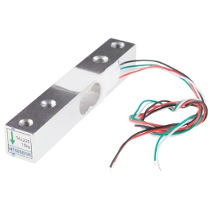
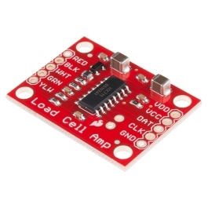

# Appendix D — Prototype Hardware Catalogue

**Project:** Multimodal non-destructive Hass avocado ripeness characterisation  
**Procurement evidence date:** 2026-07-30  
**Status:** proposal summary; the audited procurement records remain authoritative

## D.1 Purpose and controlling records

This appendix condenses the proposed hardware into an implementation-oriented catalogue. It should be read with the following local project records:

- [Audited bill of materials](../procurement/bill-of-materials.csv)
- [Detailed equipment catalogue](../procurement/equipment-catalogue.md)
- [Procurement and specification source ledger](../procurement/source-ledger.md)
- [Prototype architecture](../docs/prototype-architecture.md)
- [Local product-image licence and attribution record](../procurement/images/README.md)

The bill of materials is the controlling item-level record for manufacturer, exact model or manufacturer part number, quantity, price, currency, price status, verification date, supplier, source URL, specification, intended use, and limitation. A blank price means that no current price was verified; it does not mean zero cost.

## D.2 Procurement tiers and budgets

| Configuration | Scope | Budget basis | Total |
|---|---|---|---:|
| MVP priced core | Live-priced or current-MSRP controller, imaging, reference target, environmental sensors, CO₂, MOX gas trend, mass, ADC, storage, power, chamber, and silicon detector | Audited BOM rows in `MVP_priced_core` | **US$443.67** |
| MVP planning configuration | MVP priced core plus explicitly labelled fabrication, optical, fan, tubing, storage-media, calibration-weight, and mounting allowances | Audited BOM rows in `MVP_priced_core` and `MVP_allowances` | **US$723.62** |
| Research-grade using shared core instruments | MVP plus discrete SWIR feasibility channels, analytical-chamber/plumbing allowances, source/probe/reference-standard allowances, refractometer, penetrometer, and destructive-assay consumables | Assumes spectrometer, reference ethylene analyser, moisture analyser/oven, analytical balance, and chemistry facilities are university-owned | **US$6,591.51** |
| Research-grade buy-new baseline proxy | Shared-instrument configuration plus F-900, OHAUS MB120, and a historical NIRQuest+1.7 package proxy | Budgetary comparison only | **US$43,466.01** |
| Mid-tier compact spectrometer option | Hamamatsu C11708MA alone | Observed authorised-distributor price | **€650.53 ex VAT** |

These totals exclude tax, UAE shipping, duty, institutional procurement fees, calibration certificates and gases, optional rows, and quote-only rows unless expressly stated. The **US$43,466.01 buy-new value is not a vendor quotation**. Its NIRQuest component is transparently based on a 2023 federal contract record because the manufacturer currently quotes by optical configuration. A current written quotation is required before funding or purchase decisions.

If oil-sensitive bands near approximately 1720 and 2300 nm are a primary scientific objective, a 900–2500 nm system must be quoted. The baseline NIRQuest+1.7 option ends near 1650 nm and therefore does not cover those regions.

## D.3 Minimum viable prototype

### D.3.1 Control, imaging, and storage

| Function | Selected model / MPN | Purpose | Principal limitation |
|---|---|---|---|
| Sensor controller | Espressif `ESP32-S3-DevKitC-1-N8R8` | LED sequencing, environmental and mass acquisition, timestamps, microSD records | Integrated ADC is not the precision optical acquisition path |
| Image computer | Raspberry Pi Zero 2 W, ordering code `SC1176` | Camera control and image metadata | Reseller availability may exceed official MSRP |
| RGB camera | Raspberry Pi Camera Module 3 standard; Adafruit PID `5657` | Repeatable peel images | Camera RGB is device- and illumination-dependent; all automatic settings must be locked |
| Visible reference | Calibrite ColorChecker Classic Mini `CCC-MINI` | Colour calibration and drift checks | Not an NIR diffuse-reflectance standard |
| Local logger | Adafruit microSD breakout PID `254` plus qualified endurance card | Append-only raw records | Card authenticity, endurance, and corruption handling require verification |

### D.3.2 Environment, respiration, and broad gas response

| Function | Selected model / MPN | Defensible measurement | Claim that is not justified |
|---|---|---|---|
| Temperature/RH | Sensirion `SHT45-AD1B-R2`; Adafruit PID `5665` | Chamber-air temperature and relative humidity | Internal fruit water concentration |
| CO₂ | Sensirion SCD30; Adafruit PID `4867` | NDIR CO₂ concentration and a corrected sealed-interval accumulation slope | Ethylene, or respiration rate without chamber-volume, leak, pressure, temperature, and response corrections |
| Broad gas feature | Bosch BME688; Adafruit PID `5046` | Conditioned metal-oxide gas-resistance trajectory | Ethanol, ethylene, or any other individual VOC concentration |

The SCD30 is specified for 400–10,000 ppm. The accumulation interval must be shortened or the chamber enlarged/flushed before the signal exceeds its specified range. The BME688 is a humidity-, temperature-, baseline-, heater-history-, and mixture-dependent sensor. It is an optional multivariate odour feature, not a chemical analyser.

### D.3.3 Mass

| Function | Selected model / MPN | Purpose | Principal limitation |
|---|---|---|---|
| Force transducer | SparkFun TAL220 10 kg straight-bar load cell, `SEN-13329` | Fruit mass trajectory | Creep, temperature, mounting, off-axis loading, and cradle contact affect accuracy |
| Bridge acquisition | SparkFun HX711 board, `SEN-13879` | Load-cell excitation/readout | A 24-bit output word does not imply 24-bit system accuracy |

The assembled mechanism must be calibrated with traceable or documented check masses. Tare, stable-window criteria, temperature, fan/pump state, and before/after check weights should be recorded for each session.

The images above are exact-model SparkFun product photographs. Attribution, licence, original URLs, and SHA-256 hashes are recorded in the [local image register](../procurement/images/README.md).

### D.3.4 MVP optical head

| Channel | Exact proposed part | Intended feature | Limitation |
|---|---|---|---|
| Detector | Vishay `BPW34` | Sequential reflected-light detection from 660 to 970 nm | Silicon response ends near 1100 nm |
| 660 nm | Roithner `LED660N-03` | Chlorophyll-sensitive visible reflectance | Also affected by scattering, skin, geometry, and temperature |
| 740 nm | Roithner `LED740-03AU` | Red-edge/pigment-scattering transition | Not a unique molecular concentration |
| 850 nm | Roithner `LED850-03UP` | Tissue/skin scattering reference | Not a water or oil concentration |
| 970 nm | Roithner `LED970D-03` | Weak water-sensitive O–H feature | Must not be reported as laboratory moisture percentage without calibration |
| ADC | Adafruit ADS1115 PID `1085` | Slow transimpedance-amplifier channels | Does not provide a microspectrometer line-array readout |

The four-LED head is intended to generate controlled predictive features. It is not a spectrometer and cannot observe stronger avocado-relevant features near 1200, 1450, 1700, or 2300 nm. It requires:

- sequential constant-current LED drive;
- a low-input-bias transimpedance amplifier;
- fixed source–fruit–detector geometry and baffling;
- dark measurements before every sequence;
- a stable diffuse reference at the beginning and end of every session;
- recorded LED current, gain, integration time, sensor temperature, saturation, and component bin.

The exact LED MPNs were verified in the manufacturer’s current part/price list, but their combined US$50 value is a planning allowance pending a written bin-specific quotation.

### D.3.5 Chamber, mixing, and power

| Function | Selected model / MPN | Purpose | Principal limitation |
|---|---|---|---|
| MVP chamber shell | Integra `H12106HCF-6P-P10` | Repeatable one-fruit enclosure and sensor mounting | Polycarbonate, gasket, adhesives, coatings, and modified ports can outgas or adsorb volatiles |
| Mixing fan | Noctua `NF-A4x10 5V` | Fixed-duty headspace mixing | Heat and airflow alter gas and moisture transport; switch off during weighing |
| Low-voltage supply | Mean Well `GST60A12-P1J` | External 12 V, 5 A supply | IEC input lead and fused/switchable downstream distribution are required |
| 5 V rail | SparkFun AP63357 breakout `COM-21255` | Regulated digital/fan rail | Observe current and thermal derating |

The enclosure’s original environmental rating applies before drilling or modifying it. An empty-chamber blank, leak test, dose/recovery test, and cleaning/cure protocol are mandatory. A borosilicate or stainless vessel with PTFE-faced seals is preferred for quantitative volatile work.

## D.4 Optional and bridge equipment

### D.4.1 AS7341 colour-spectral breakout

The ams OSRAM AS7341 breakout, Adafruit PID `4698`, offers eight visible bands plus broad NIR, clear, and flicker channels. It can enrich surface-pigment features but is neither a continuous spectrum nor a water/oil NIR analyser. It was out of stock at the audited US$18.95 supplier price and should not block the MVP.

### D.4.2 Low-cost electrochemical ethylene

SPEC Sensors `970-650` (DGS2-C2H4) is an optional **bridge sensor**, not the project’s ethylene ground truth. The manufacturer’s cross-sensitivity information shows responses to ethanol, hydrogen sulfide, sulfur dioxide, nitric oxide, and formaldehyde. Avocado headspace is a mixed, humid matrix, so the module may be used only after comparison against a reference analyser across:

- ethylene calibration level;
- temperature and RH;
- CO₂ and ethanol;
- fruit load and ripeness stage;
- response/recovery time;
- baseline drift and repeated cycles.

Report bias, precision, selectivity, limit of detection/quantification, and uncertainty before interpreting its output as concentration.

### D.4.3 Low-cost pump

The SparkFun 12 V vacuum pump may flush a prototype loop. Its wetted materials are not specified for quantitative volatile recovery, so it must remain outside the analytical reference path unless blank, adsorption, and recovery performance are established.

## D.5 Research-grade optical configuration

### D.5.1 Compact 640–1050 nm option

The Hamamatsu `C11708MA` is a 256-pixel, 640–1050 nm miniature spectrometer with typical 15 nm spectral resolution. It is a bare analogue head requiring optics, timing, buffering, ADC acquisition, shielding, and dark/white calibration. It can improve pigment, scattering, and weak 970 nm measurements but cannot observe the stronger SWIR water/lipid regions.

The smaller `C14384MA-01` is a quote-only alternative with higher sensitivity near 1000 nm. No current authorised price was verified.

### D.5.2 Calibrated SWIR option

The proposed research baseline is a cooled InGaAs instrument such as Ocean Insight `NIRQUEST+1.7-XX`, configured by quotation with:

- a stabilised tungsten-halogen source;
- matched fibres;
- repeatable interactance and reflectance probe fixtures;
- slit/grating selected for the required resolution and throughput;
- certified diffuse reflectance standard;
- wavelength and photometric checks.

Its 900–1650 nm range captures useful 1200 and 1450 nm information. An extended-range `NIRQuest+2.5` or equivalent should be quoted for 1720/2300 nm oil-sensitive work.

Three Marktech `MTPD1346D-100` InGaAs photodiodes and Roithner `LED1200S-03`/`LED1450S-03` emitters are budgeted as a discrete-band feasibility step. These channels require low-noise analogue electronics and dark/temperature correction and do not replace spectroscopy.

## D.6 Research-grade headspace configuration

| Function | Proposed equipment | Procurement status |
|---|---|---|
| Reference ethylene | Felix Instruments `F-900` or validated GC method | Prefer university-shared; F-900 observed at US$10,495 |
| Chamber | Custom known-volume borosilicate/stainless vessel with PTFE-faced seals | US$1,000 design allowance; engineering/RFI required |
| Tubing | Cole-Parmer PTFE `UX-50119-48` | US$367.50 for 50 ft at audit |
| Research pump | KNF `NMP 830`, configuration with suitable wetted materials | Quote only |
| Flow control | Low-dead-volume meter, valves, fittings, filters | US$250 allowance pending frozen flow specification |

The F-900 manufacturer’s PPB-channel specification is 0–10 ppm with 0.001 ppm resolution, stated 25 ppb detection limit, and stated accuracy of \(5\% \pm 0.025\) ppm. The applicable calibration and interference-removal protocol must still be followed. Reference-grade equipment does not eliminate the need for humid-headspace method validation.

## D.7 Destructive ground truth

| Measurement | Equipment | Procurement decision | Key limitation |
|---|---|---|---|
| Soluble solids | ATAGO PAL-1, Cat. No. `3810` | US$330 direct price | Brix is concentration and includes effects of water loss and non-sugar solutes |
| Firmness | QA Supplies FT327, SKU `2006060` | US$285 | Fresh harvest fruit may exceed range; probe/site/speed/depth protocol determines repeatability |
| Moisture/dry matter | OHAUS MB120 AM, material `30241165`, or validated oven method | Prefer laboratory-owned; 2026 authorised MAP US$6,400.50 | Halogen endpoint must be validated against the adopted reference method |
| Starch and oil | Validated laboratory assay/extraction facilities | Institutional method and safety plan required | No product number or performance is asserted before method selection |

The proposal must retain moisture/dry matter, mass, Brix, starch, firmness, and oil as separate variables. Brix alone cannot distinguish biochemical sugar formation from concentration caused by water loss.

## D.8 Procurement sequence

1. Confirm university-owned spectrometer, F-900/GC, moisture analyser/oven, analytical balance, chemistry facilities, and gas-calibration resources.
2. Order the MVP priced-core items.
3. Obtain the exact Roithner LED quotation and select wavelength bins.
4. Freeze chamber dimensions, optical fixture, analogue gains, plumbing sizes, and safety design.
5. Purchase fabrication and consumables against final drawings rather than allowances.
6. Complete incoming inspection, serial/lot records, calibration, blank, leak, recovery, optical repeatability, load-cell creep, and clock-synchronisation tests.
7. Collect biological data only after the acceptance criteria in the [prototype architecture](../docs/prototype-architecture.md#8-acceptance-criteria-before-biological-data-collection) are satisfied.

## D.9 Documentation and non-quotation notice

Every purchase should archive the supplier quotation, access date, currency, tax/freight, lead time, exact MPN, datasheet revision, received serial/lot, calibration certificate, incoming test, and warranty. The project’s [source ledger](../procurement/source-ledger.md) records the evidence used at proposal time.

This appendix is a technical planning document. It is not a request for quotation, offer, warranty of availability, or representation of landed cost. Prices and stock must be reconfirmed by the purchasing institution.
