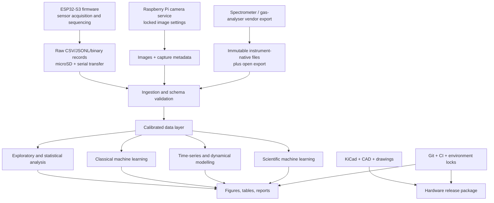

# Appendix F — Proposed Software Stack

**Project:** Multimodal non-destructive Hass avocado ripeness characterisation  
**Status:** reproducible-stack design  
**Version policy:** no runtime or package version has been verified locally for this appendix; every version below is therefore marked **to be pinned**

## F.1 Reproducibility policy

The software stack should be fixed only after the target workstations, embedded boards, and any university high-performance-computing environment are confirmed. “Latest” must never appear in an environment definition. The implementation should:

1. record operating system, architecture, compiler, firmware, interpreter, package, driver, and instrument-software versions;
2. pin direct and transitive dependencies in lock files;
3. preserve raw data separately from calibrated and derived outputs;
4. place every result under a configuration, code commit, data-manifest, calibration, and random-seed identity;
5. execute validation and analysis through scripts or workflow targets rather than undocumented notebook state;
6. export open, archival tables and figures in addition to proprietary formats.

Because versions have not been locally verified, the first implementation task is to generate and review the lock files on the actual acquisition and analysis computers.

## F.2 Stack overview



## F.3 Firmware and embedded acquisition

| Component | Proposed choice | Version | Purpose |
|---|---|---|---|
| ESP32 framework | Espressif ESP-IDF | **To be pinned** | Production firmware, drivers, tasks, storage, communications, and hardware test |
| Optional development layer | PlatformIO Core and Espressif32 platform | **To be pinned** | Repeatable local builds and board configuration if it does not obscure ESP-IDF versions |
| Language/toolchain | C/C++ and Espressif GCC toolchain | **To be pinned** | Deterministic embedded implementation |
| Build system | CMake/Ninja as supplied by the chosen ESP-IDF release | **To be pinned** | Reproducible firmware build |
| Unit testing | Unity test framework supplied by ESP-IDF | **To be pinned with ESP-IDF** | Sensor-driver and conversion tests |
| Static analysis | clang-format, clang-tidy, cppcheck | **To be pinned** | Formatting and defect checks |
| Serial protocol | Versioned newline-delimited JSON for development; compact framed binary or CSV where required | Schema version **to be defined** | Observable transfer and recovery |
| Local storage | FAT-compatible microSD with append-only session files | Format/procedure **to be frozen** | Power-loss-tolerant raw logging |

Firmware responsibilities:

- hardware and firmware identity at boot;
- monotonic and UTC timestamps with synchronisation status;
- non-blocking schedules for SHT45, SCD30, BME688, HX711, ADS1115, fan, pump, and LEDs;
- explicit chamber state machine: open/flush, equilibrate, accumulate, vent, optical, weigh;
- LED wavelength, current, detector gain, integration, dark/reference/fruit state, and saturation flags;
- raw sensor counts alongside converted engineering units;
- watchdog, brownout, SD-write, sensor-timeout, range, and CRC/error records;
- a safe output state after reboot or communication loss;
- a hardware-in-the-loop diagnostic mode.

Suggested firmware repository location:

```text
firmware/
  CMakeLists.txt
  sdkconfig.defaults
  partitions.csv
  main/
  components/
    acquisition/
    chamber_state/
    sensors/
    optical_head/
    storage/
    telemetry/
  test/
  tools/
```

Do not commit generated build directories or credentials. Commit `sdkconfig.defaults`, pin the ESP-IDF release, and archive the full build manifest with each flashed binary.

## F.4 Camera acquisition

| Component | Proposed choice | Version | Purpose |
|---|---|---|---|
| Raspberry Pi OS Lite | 64-bit image compatible with Zero 2 W | **To be pinned by image date/hash** | Minimal camera host |
| Camera API | libcamera/rpicam applications and Picamera2 | **To be pinned together** | Manual camera control and metadata |
| Camera service | Python service using Picamera2 or a shell-free native wrapper | **To be pinned** | Session-triggered image acquisition |
| Image processing | OpenCV-Python, Pillow, colour-science | **To be pinned** | Calibration target detection and colour extraction |
| Metadata | ExifTool or native sidecar JSON writer | **To be pinned** | Exposure, gain, focus, white balance, device, and session provenance |

Camera acquisition must freeze:

- sensor mode and image dimensions;
- focus position;
- exposure time and analogue/digital gain;
- white balance gains;
- denoise, sharpening, HDR, gamma, and compression policy;
- camera–fruit distance, illumination, crop, and orientation;
- ColorChecker identity and calibration-frame timing.

Retain original captures and JSON sidecars. Produce calibrated \(L^*, a^*, b^*\), hue, chroma, patch residuals, fruit masks, and quality flags in the derived layer; do not overwrite the originals.

## F.5 Instrument acquisition

Vendor applications may be unavoidable for the spectrometer, F-900, moisture analyser, or other laboratory instruments. The acquisition policy is:

1. retain the untouched native file;
2. export an open CSV or text representation without deleting the native file;
3. record instrument model, serial, firmware, vendor-software version, method, integration time, averaging, dark/white reference, calibration file, flow, and operator;
4. compute a SHA-256 hash of every raw file after transfer;
5. map each observation to `study_id`, `fruit_id`, `session_id`, scan zone, azimuth, UTC time, and calibration ID.

Where an instrument offers an SDK:

| Instrument layer | Proposed interface | Version |
|---|---|---|
| Ocean Insight spectrometer | Manufacturer-supported API/SDK or SeaBreeze-compatible interface validated for the purchased model | **To be pinned after model quotation** |
| Hamamatsu microspectrometer | Project-specific ESP32/desktop readout designed from the exact datasheet timing requirements | Firmware and acquisition package **to be pinned** |
| Felix F-900 | Manufacturer export/software and documented serial or file interface | **To be pinned after instrument access** |
| Laboratory balance/moisture equipment | Vendor export or validated manual double-entry workflow | **To be pinned or method-controlled** |

An unsupported community driver should not become the only way to recover primary instrument data.

## F.6 Core Python analysis environment

Python is the principal analysis language. MATLAB and R remain optional where a university method or collaborator requires them.

| Package/tool | Version | Role |
|---|---|---|
| Python | **To be pinned** | Analysis runtime |
| uv or Conda/Mamba | **To be selected and pinned** | Environment and lock management |
| NumPy | **To be pinned** | Numerical arrays and linear algebra |
| SciPy | **To be pinned** | Optimisation, integration, signal processing, statistics |
| pandas | **To be pinned** | Tabular and longitudinal data handling |
| Polars | **Optional; to be pinned** | Fast columnar processing for large spectral tables |
| PyArrow | **To be pinned** | Parquet/Arrow interchange |
| h5py and/or Zarr | **To be pinned** | Dense spectral/time-series arrays where Parquet is unsuitable |
| xarray | **To be pinned** | Labelled wavelength/time arrays |
| pydantic | **To be pinned** | Configuration and record-schema validation |
| pandera | **To be pinned** | Data-frame schema validation |
| pint | **To be pinned** | Unit-aware calculations |
| OpenCV | **To be pinned** | Image registration, masks, target detection, colour extraction |
| Pillow | **To be pinned** | Image I/O and metadata support |
| colour-science | **To be pinned** | Colour-space conversion and colour difference |
| scikit-image | **To be pinned** | Image features and quality checks |
| matplotlib | **To be pinned** | Static publication figures |
| seaborn | **To be pinned** | Statistical plots |
| Plotly | **Optional; to be pinned** | Interactive diagnostics |
| JupyterLab | **To be pinned** | Exploration only; final outputs must run from scripts/workflows |

Recommended open formats:

- CSV for small human-inspectable acquisition records;
- Parquet for validated tabular observations and features;
- TIFF/PNG or documented original camera format plus JSON sidecars for images;
- HDF5 or Zarr for large wavelength × sample arrays;
- YAML or TOML for human-authored configuration;
- JSON for immutable run manifests;
- SVG/PDF/PNG for figures;
- Markdown, BibTeX, CSL JSON, and PDF for documentation.

## F.7 Quality control, signal processing, and chemometrics

| Package/tool | Version | Role |
|---|---|---|
| SciPy signal module | **To be pinned with SciPy** | Filters, peak checks, numerical derivatives |
| pybaselines | **To be pinned** | Baseline correction where justified |
| pywavelets | **Optional; to be pinned** | Wavelet denoising experiments |
| scikit-learn | **To be pinned** | Preprocessing, PLS, PCA, cross-validation, metrics |
| statsmodels | **To be pinned** | Regression, repeated-measures and diagnostic models |
| pingouin | **Optional; to be pinned** | Convenient statistical summaries after method review |
| lmfit | **To be pinned** | Constrained nonlinear parameter fitting |
| ruptures | **Optional; to be pinned** | Change-point analysis |

Candidate spectral preprocessing should be treated as a model hyperparameter inside grouped validation, not chosen after inspecting test outcomes. Candidates include:

- dark subtraction and reference normalisation;
- absorbance transform where physically appropriate;
- standard normal variate;
- multiplicative scatter correction;
- Savitzky–Golay smoothing and first/second derivatives;
- wavelength selection;
- replicate aggregation with retained within-fruit variance.

Every transform must record its fitted parameters and be learned from training data only.

## F.8 Statistical analysis

| Component | Proposed choice | Version |
|---|---|---|
| Classical and mixed-effects statistics | statsmodels | **To be pinned** |
| Optional R workflow | R, `lme4`, `nlme`, `emmeans`, `brms` | **To be pinned only if adopted** |
| Bayesian modelling | PyMC and ArviZ | **To be pinned** |
| Alternative probabilistic stack | Stan via CmdStanPy | **Optional; to be pinned** |
| Power/simulation | Python simulation scripts; optional R packages | **To be pinned** |

Fruit ID, orchard/batch, storage block, acquisition day, scan zone, and repeated measurements should be represented explicitly. Confidence intervals and uncertainty must reflect biological replication, not the number of spectra alone.

## F.9 Machine-learning stack

### F.9.1 Baseline and tabular models

| Tool | Version | Intended models |
|---|---|---|
| scikit-learn | **To be pinned** | PLS regression, logistic/ordinal regression, SVM, random forest, elastic net, Gaussian process, PCA |
| XGBoost | **To be pinned** | Gradient-boosted trees |
| LightGBM | **To be pinned** | Gradient-boosted trees where installation/support is acceptable |
| Optuna | **To be pinned** | Nested hyperparameter optimisation |
| imbalanced-learn | **Optional; to be pinned** | Training-fold-only imbalance handling |
| SHAP | **To be pinned** | Post-hoc feature attribution with stated limitations |

PLS, regularised linear models, and tree ensembles are the primary baselines for modest biological sample sizes. Deep learning should not precede strong grouped baselines.

### F.9.2 Deep and multimodal learning

| Tool | Version | Intended use |
|---|---|---|
| PyTorch | **To be pinned** | Principal neural-network framework |
| torchvision | **To be pinned with PyTorch** | RGB encoders and image transforms |
| Lightning | **Optional; to be pinned** | Structured training loops and checkpointing |
| TensorFlow/Keras | **Optional alternative; to be pinned only if selected** | Do not maintain duplicate production implementations |
| JAX | **Optional; to be pinned only if SciML method requires it** | Differentiable numerical models |
| einops | **To be pinned if used** | Auditable tensor rearrangement |
| timm | **Optional; to be pinned** | Pretrained image encoders |

Candidate architectures include one-dimensional spectral CNNs, temporal convolutional networks, LSTM/GRU models, small transformers, and late-fusion multimodal networks. Model size must be constrained by the number of independent fruit and biological batches.

## F.10 Scientific machine learning and dynamical models

| Method | Proposed software | Version | Role |
|---|---|---|---|
| Candidate ODE/PDE fitting | SciPy `solve_ivp`, optimisation, and least squares | **To be pinned** | Transparent mechanistic baselines |
| Neural ODE | `torchdiffeq` or equivalent | **To be pinned if selected** | Learn continuous latent ripening dynamics |
| Sparse equation discovery | PySINDy | **To be pinned** | Candidate governing-term discovery |
| Physics-informed networks | DeepXDE or a reviewed PyTorch/JAX implementation | **To be pinned if selected** | Soft physical constraints and inverse problems |
| Differentiable ODE solvers | Diffrax if JAX is selected | **To be pinned if selected** | Neural/differentiable dynamical models |
| Symbolic regression | PySR | **To be pinned** | Interpretable candidate rate laws |
| State-space estimation | filterpy or custom reviewed implementation | **To be pinned if selected** | Kalman/extended/unscented filtering |
| Bayesian dynamical inference | PyMC or Stan | **To be pinned** | Parameter/posterior uncertainty |
| Gaussian processes | scikit-learn and/or GPyTorch | **To be pinned if selected** | Nonlinear trends and calibrated uncertainty |

These tools infer or fit **candidate** models. They do not establish a governing equation merely because a low residual is obtained. Evaluation must include dimensional consistency, identifiability, parameter uncertainty, residual structure, extrapolation, held-out fruit/batches, and comparison with simpler kinetics.

## F.11 Experiment tracking and validation

| Component | Proposed choice | Version |
|---|---|---|
| Configuration | Hydra/OmegaConf or typed TOML/YAML with pydantic | **To be selected and pinned** |
| Experiment tracking | MLflow, or local immutable run manifests if a service is unnecessary | **To be selected and pinned** |
| Data versioning | DVC or lakeFS only if operational support exists; otherwise content-addressed manifests | **To be selected and pinned** |
| Tests | pytest, pytest-cov, hypothesis | **To be pinned** |
| Lint/format | Ruff | **To be pinned** |
| Type checking | mypy or Pyright | **To be selected and pinned** |
| Security/dependency audit | pip-audit and repository secret scanning | **To be pinned** |
| Workflow orchestration | Snakemake or Make | **To be selected and pinned** |
| Containers | Docker/Podman where permitted | Engine and base-image digest **to be pinned** |
| Version control | Git | **To be pinned/documented by environment** |

Minimum automated checks:

- schema and unit validation;
- duplicate and impossible timestamp checks;
- calibration linkage and range flags;
- train/test fruit-ID separation;
- deterministic-seed and environment capture;
- unit tests for all conversions and rate calculations;
- synthetic tests for ODE/parameter-recovery code;
- notebook execution from a clean kernel;
- figure/table reproduction from immutable inputs;
- firmware build and host-parser compatibility.

## F.12 Data splitting and model-evaluation safeguards

All spectra, zones, images, and days belonging to one fruit must remain in the same outer split. Where the intended deployment crosses harvest batches, orchards, seasons, storage regimens, cameras, or prototypes, those domains should be held out explicitly.

Recommended hierarchy:

1. development set with grouped cross-validation by fruit and batch;
2. untouched internal test set of fruit;
3. external batch/season/device validation;
4. prospective confirmation after model freeze.

Hyperparameter optimisation, preprocessing, imputation, feature selection, augmentation, calibration, and threshold selection must occur inside the training folds. Report fruit-level and observation-level metrics separately, including uncertainty.

## F.13 CAD, enclosure, PCB, and engineering documentation

| Discipline | Proposed tool | Version | Output |
|---|---|---|---|
| PCB/schematic | KiCad | **To be pinned** | Source project, schematic PDF, Gerbers, drill, BOM, pick-and-place, ERC/DRC reports |
| Parametric mechanical CAD | FreeCAD and/or OpenSCAD | **To be selected and pinned** | Editable open-source geometry and STEP/STL exports |
| Institutional/commercial CAD | Fusion 360 or SolidWorks where licences exist | **To be pinned if used** | Native source plus STEP/DXF/PDF neutral exports |
| Diagramming | Mermaid and SVG source | Renderer **to be pinned** | Architecture and protocol diagrams |
| Electronics simulation | LTspice or ngspice | **To be selected and pinned** | TIA and driver simulation source/results |
| 3D slicing | PrusaSlicer or Cura | **To be pinned if printed parts are used** | Project file, material/profile, G-code metadata |

Mechanical and PCB releases should carry a revision, compatible BOM revision, drawing dimensions/tolerances, material and surface-finish specification, and assembly/calibration instructions. Gas-wetted materials and optical black coatings require explicit blank/recovery validation.

## F.14 Documentation, references, and publication

| Tool | Version | Role |
|---|---|---|
| Markdown | CommonMark/GitHub-compatible source | Human-readable canonical documentation |
| Pandoc | **To be pinned** | Markdown-to-PDF/DOCX conversion |
| LaTeX engine | TeX Live and selected engine | **To be pinned by distribution/date** |
| Quarto | **Optional; to be pinned** | Reproducible manuscripts/reports if adopted |
| Zotero | **To be pinned/documented** | Reference library |
| Better BibTeX | **To be pinned with Zotero** | Stable citation keys and BibTeX export |
| CSL style | Commit exact `.csl` file | Journal/funder citation format |
| Graphviz/Mermaid CLI | **To be pinned** | Deterministic diagram rendering |

The appendices link to the project’s local source records:

- [Prototype architecture](../docs/prototype-architecture.md)
- [Audited BOM](../procurement/bill-of-materials.csv)
- [Detailed hardware catalogue](../procurement/equipment-catalogue.md)
- [Procurement source ledger](../procurement/source-ledger.md)
- [Hardware Appendix D](appendix-d-hardware-catalogue.md)

For PDF production, the build should resolve these relative links from the repository root or copy linked assets into a controlled staging directory without altering their names or hashes.

## F.15 Proposed repository structure

```text
.
├── analysis/
│   ├── configs/
│   ├── notebooks/
│   ├── src/
│   ├── tests/
│   └── workflows/
├── appendices/
├── cad/
│   ├── chamber/
│   ├── fixtures/
│   └── exports/
├── data/
│   ├── external/
│   ├── manifests/
│   ├── processed/
│   ├── raw/
│   └── schemas/
├── docs/
├── firmware/
├── ml/
│   ├── configs/
│   ├── models/
│   ├── tests/
│   └── training/
├── models/
│   ├── bayesian/
│   ├── candidate_odes/
│   ├── pinn/
│   ├── sindy/
│   └── symbolic/
├── pcb/
├── procurement/
├── proposal/
├── references/
├── reports/
├── results/
│   ├── figures/
│   ├── metrics/
│   ├── models/
│   └── tables/
└── scripts/
```

Raw and external datasets should normally be excluded from Git and governed by checksummed manifests, licence terms, and access controls. Small schemas, metadata, calibration templates, and synthetic test fixtures should be version-controlled.

## F.16 Environment artefacts to create before analysis

The implementation phase should produce:

- `firmware/esp-idf-version.txt` or equivalent exact framework commit;
- `firmware/sdkconfig.defaults`;
- `pyproject.toml`;
- an exact Python lock file generated on the target platform;
- optional Conda environment lock for native scientific dependencies;
- container definition with base-image digest where containers are allowed;
- `CITATION.cff`;
- `LICENSE` and third-party notices;
- pre-commit configuration;
- CI workflow;
- schema and unit registry;
- dataset manifest specification;
- model/run manifest specification;
- pinned Pandoc/LaTeX/diagram build environment.

An environment is accepted only after a clean machine can acquire a synthetic/device test session, validate the records, run the analysis test suite, train a small baseline, and reproduce a reference figure and report without undocumented manual steps.

## F.17 Security, privacy, and operational constraints

- Do not place Wi-Fi passwords, API tokens, participant information, or supplier credentials in the repository.
- Use least-privilege device/network access; acquisition should continue locally during network failure.
- Validate all imported CSV, image, instrument, and configuration files.
- Archive checksums before transforming raw instrument exports.
- Record destructive edits and exclusions in an auditable data-quality table.
- Back up raw data to at least two independent media/locations under institutional policy.
- Treat firmware update, time synchronisation, and device replacement as controlled changes that can shift the measurement domain.

## F.18 Final selection gate

Before pinning the production stack, the team should confirm:

1. host operating systems and CPU/GPU architectures;
2. exact ESP32 board revision and camera computer;
3. purchased/shared spectrometer and its supported SDK;
4. F-900/GC and laboratory export formats;
5. university restrictions on Docker, cloud tracking, MATLAB, Fusion 360, and data storage;
6. publication target and required citation/report format;
7. whether JAX, TensorFlow, R, MATLAB, or commercial CAD adds a method not already covered by the principal stack.

The preferred minimal production path is **ESP-IDF + Raspberry Pi camera tools + Python/SciPy/pandas/scikit-learn/PyTorch + PyMC/PySINDy as justified + KiCad + open neutral CAD exports + Git and locked environments**. Optional frameworks should be added only for a defined scientific requirement, not as parallel implementations of the same workflow.
