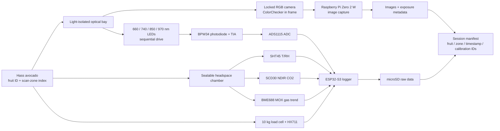
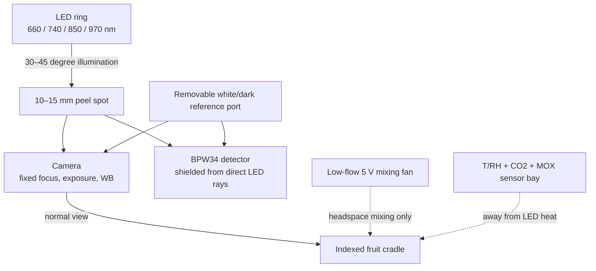
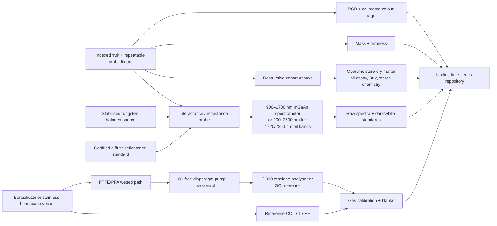
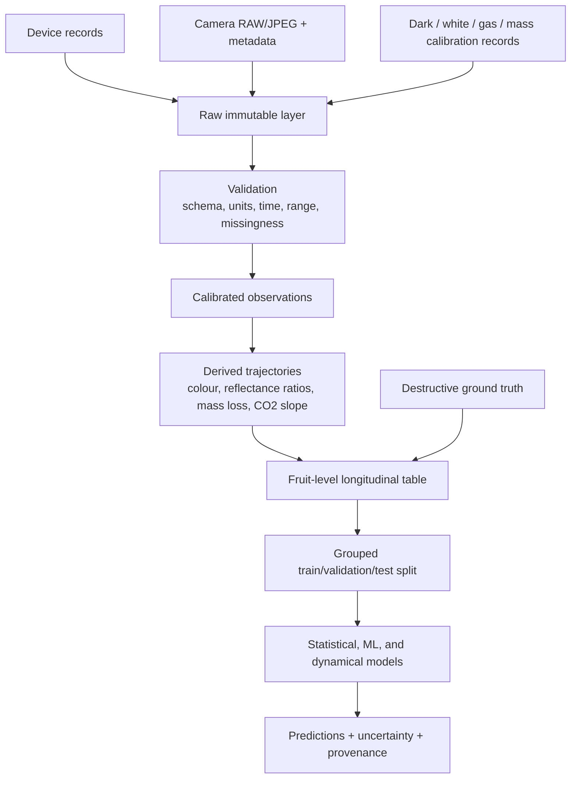

# Prototype Architecture: Multimodal Hass Avocado Ripeness Characterisation

**Document status:** procurement-ready design basis  
**Price/specification verification date:** 2026-07-30  
**Scope:** Phases 9–10 hardware and measurement architecture

## 1. Design intent

The apparatus is a longitudinal measurement system, not a consumer “ripeness meter.” It is designed to collect repeatable optical, mass, environmental, respiration, and optional headspace-gas observations from individually identified Hass avocados, then link those observations to destructive reference measurements.

Two configurations are defined:

1. **Minimum viable prototype (MVP):** affordable, repeatable sensing of RGB colour, four broad optical features (660/740/850/970 nm), mass, temperature, relative humidity, CO₂ accumulation, and a non-specific metal-oxide VOC trend.
2. **Research-grade system:** calibrated 900–1700 nm or 900–2500 nm spectroscopy, controlled interactance/reflectance geometry, inert headspace plumbing, reference-grade ethylene analysis, and laboratory ground truth.

The MVP can establish whether multimodal trajectories contain predictive information. It cannot make compound-specific claims about tissue water, oil, ethanol, or ethylene without validation against reference methods.

## 2. Measurement claims by sensor

| Channel | Direct observation | Defensible derived use | Claim that must **not** be made |
|---|---|---|---|
| Locked RGB camera + colour target | Calibrated surface colour | \(L^*,a^*,b^*\), hue, chroma, colour-change rate | Peel darkness is a universal measure of edible ripeness |
| 660 nm reflectance | Chlorophyll-sensitive visible reflectance plus scattering | Surface pigment trend | Chlorophyll concentration without chemical calibration |
| 740 nm reflectance | Red-edge / pigment-scattering transition | Normalisation and pigment-transition feature | A unique molecular concentration |
| 850 nm reflectance | Primarily tissue/skin scattering reference in this design | Structural/reference channel | Water or oil concentration |
| 970 nm reflectance | Weak O–H water overtone plus scattering | Water-sensitive trend after calibration | Laboratory-grade moisture percentage |
| SHT45 | Chamber air temperature and RH | Environmental covariates and vapour-pressure deficit | Internal fruit water content |
| Load cell | Fruit-plus-cradle force | Mass-loss trajectory after tare/drift correction | Water loss alone; respiration also removes mass |
| NDIR CO₂ | CO₂ concentration in the specified range | Sealed-interval CO₂ accumulation slope / apparent respiration | Ethylene or total respiration without chamber-volume and leak correction |
| BME688 | Metal-oxide gas resistance and environmental channels | Conditioned “VOC index” or multivariate odour trajectory | Ethanol, ethylene, or any single VOC concentration |
| Electrochemical C₂H₄ sensor | Cross-sensitive current converted to indicated ethylene | Exploratory trend after matrix-specific validation | Reference ethylene concentration in fruit headspace |
| F-900 or GC reference | Ethylene under the instrument’s validated protocol | Quantitative headspace ethylene | Unqualified selectivity where scrubber/protocol controls are omitted |

## 3. Minimum viable architecture

### 3.1 System block diagram

### 3.2 Chamber and optical layout

The transparent enclosure is a convenient prototype shell, not an inert analytical chamber. Install a removable matte-black optical shroud and a cradle that constrains stem–blossom orientation. Use three axial scan zones (stem shoulder, equator, blossom shoulder) and at least three indexed azimuths. The optics should touch neither peel nor chamber wall.

Recommended geometry:

- camera axis approximately normal to the peel;
- LED axes 30–45° from normal to reduce specular reflection;
- detector approximately 0–15° from normal with a black baffle;
- fixed fruit-to-camera, LED-to-spot, and detector-to-spot distances;
- a dark reading before each wavelength sequence;
- a stable diffuse white reference at the beginning and end of every session;
- no automatic exposure, automatic white balance, autofocus hunting, or image enhancement after protocol lock.

The four LED channels are deliberately modest. Literature assigns avocado-relevant information near 680 nm (chlorophyll), approximately 970 nm (water), 900–920/1200/1700 nm (lipid-related C–H overtones), and approximately 1450/1930 nm (strong water absorption). A silicon BPW34 ends near 1100 nm, so the MVP cannot observe the stronger 1200/1450/1700 nm features. Its 970 nm output is therefore a calibrated feature, not a stand-alone moisture assay.

### 3.3 Headspace cycle

Do not store fruit in a permanently sealed prototype chamber. A standardised transient measurement reduces hypoxia, condensation, and history dependence.

```mermaid
stateDiagram-v2
    [*] --> OpenFlush
    OpenFlush: Door open or filtered-air flush\nrecord ambient baseline
    OpenFlush --> Equilibrate: fruit inserted; door closes
    Equilibrate: fan mixes; LEDs off\nwait fixed thermal interval
    Equilibrate --> Accumulate
    Accumulate: sealed fixed-duration interval\nlog CO2, T, RH, MOX at 1–5 s
    Accumulate --> Vent
    Vent: open/flush until baseline recovery
    Vent --> Optical
    Optical: light-isolated RGB + sequential LEDs\nrecord dark and reference
    Optical --> Weigh
    Weigh: fan/pump off; stable mass window
    Weigh --> [*]
```

For each accumulation interval, estimate:

\[
\dot C_{CO_2}=\frac{d C_{CO_2}}{dt}
\]

and, only after leak, empty-chamber, volume, temperature, pressure, and sensor-dynamic corrections:

\[
r_{CO_2}\approx
\frac{V_h}{m_f}\frac{P}{RT}\frac{d x_{CO_2}}{dt}
\]

where \(V_h\) is free headspace volume, \(m_f\) fruit mass, and \(x_{CO_2}\) mole fraction. If the SCD30 exceeds its specified 10,000 ppm range, shorten the sealed interval or enlarge/flush the chamber; do not extrapolate.

### 3.4 Electronics

- ESP32-S3 controls LED multiplexing, fan and optional pump, reads SHT45/SCD30/BME688/HX711/ADS1115, timestamps records, and writes microSD.
- Raspberry Pi Zero 2 W captures the Camera Module 3 images. It may also receive the ESP32 session trigger over UART/Wi-Fi.
- ADS1115 is suitable for the slow discrete photodiode channels. It is **not** a replacement for the timing, buffering, optics, and acquisition electronics required by a 256-pixel Hamamatsu microspectrometer.
- A transimpedance amplifier with low bias current, selectable gain, guarding, and a light-tight detector baffle is required. Record detector saturation, ADC range, gain, LED current, integration time, and temperature with every scan.
- Keep LED and fan currents out of the analogue ground path. Use a star ground, local decoupling, current-limited LED drivers, a fused 12 V supply, and a 5 V buck converter.

## 4. Research-grade architecture

### 4.1 Spectral choice

- **640–1050 nm silicon microspectrometer:** compact mid-tier instrument for pigment, scattering, and the weak ~970 nm water band. Hamamatsu C11708MA is appropriate for proof-of-concept spectral reconstruction, but its typical 15 nm resolution and silicon cutoff do not capture 1200, 1450, 1720, or 2300 nm bands.
- **900–1650 nm cooled InGaAs:** captures stronger 1200 and 1450 nm water/lipid features and is the recommended research baseline for moisture/dry-matter prediction. Ocean NIRQuest+1.7 is an example; obtain a current quotation and specify slit/fibre configuration.
- **900–2500 nm InGaAs/extended-range:** needed if the study explicitly targets the 1720 and 2300 nm lipid bands reported in avocado literature. This is a shared-core or quote-only instrument, not an MVP purchase.

Interactance geometry should be evaluated alongside reflectance because published avocado dry-matter work found interactance superior under its conditions. A probe fixture must prevent source light from directly reaching the collection fibre and must control contact pressure/stand-off.

### 4.2 Gas choice

1. **CO₂:** NDIR is chemically appropriate and affordable. Use a calibrated accumulation slope within specified range.
2. **MOX VOC:** useful as a broad, humidity-sensitive odour fingerprint. It cannot label ethanol or ethylene.
3. **Electrochemical ethylene:** SPEC DGS2-C2H4 (970-650) is inexpensive enough for an exploratory bridge, but the published cross-sensitivity table shows responses to ethanol, H₂S, SO₂, NO, and formaldehyde. Fruit headspace is exactly the kind of mixed matrix in which validation is mandatory.
4. **Reference ethylene:** use a F-900 with its interference-removal protocol or a validated GC method. The F-900’s PPB sensor specification is 0–10 ppm, 0.001 ppm resolution, 25 ppb detection limit, and \(5\% \pm 0.025\) ppm stated accuracy. Treat it as shared university equipment where possible.

Any low-cost ethylene sensor must be compared against the reference across temperature, RH, CO₂, ethanol, fruit load, and ripeness stage. Report bias, limit of detection/quantification, response/recovery, drift, and cross-sensitivity before using it as a concentration channel.

## 5. Calibration and quality-control plan

| Frequency | Check |
|---|---|
| Every optical session | Dark frame, diffuse white reference, ColorChecker image, fixed-exposure metadata, detector saturation check |
| Every weighing session | Tare; zero stability; one check mass before/after batch |
| Every headspace session | Ambient baseline, empty-chamber blank, recovery-to-baseline criterion, chamber-close timestamp |
| Daily | Leak/recovery control; sensor clock synchronisation; chamber cleaning status |
| Weekly or per study block | CO₂ span/zero check; mass multi-point calibration; colour-target condition; reference-fruit repeatability |
| Before/after campaign | Spectral wavelength/photometric validation; gas calibration; inter-device comparison |

Required controls include an empty chamber, an inert object of similar volume, repeated scans of one reference surface, duplicate fruit scans, and destructive replicates. Randomise measurement order within each day. Model fruit ID as a grouping factor to prevent repeated observations of one fruit leaking into both train and test sets.

## 6. Data flow and file contract

Minimum record keys:

`study_id`, `fruit_id`, `cultivar`, `batch_id`, `harvest/receipt_date`, `storage_history`, `session_id`, `timestamp_utc`, `scan_zone`, `azimuth`, `device_id`, `firmware_version`, `calibration_id`, `raw_value`, `unit`, `quality_flag`.

Never overwrite raw sensor counts or original images. Store transformed values separately with the exact calibration and code version. Each destructive specimen should remain linked to its non-destructive history and sampling location.

## 7. Mechanical and experimental limitations

- Polycarbonate, adhesives, paint, gasket material, tubing, and 3D-printed polymers can outgas or adsorb volatiles. Perform blank and recovery studies. Use borosilicate/stainless and PTFE/PFA wetted paths for analytical gas work.
- A fan improves mixing but adds heat and can alter surface mass transfer. Keep fan speed and duty cycle fixed, log them, and switch the fan off for weighing.
- Camera and LED heat can perturb the chamber. Separate optical and accumulation phases and record temperature continuously.
- Fruit curvature, lenticels, bloom, bruising, sun exposure, orientation, and peel thickness change optical measurements. Multiple controlled zones are mandatory.
- Mass change is the net effect of transpiration, respiration, handling, and deposits/condensation. It is not automatically equal to water loss.
- Brix is a concentration, not a starch-to-sugar mass balance. Pair it with moisture/dry matter and, if claimed, a validated starch assay.
- Destructive firmness varies with probe, peel removal, penetration depth, speed, and site. Freeze the protocol before data collection.

## 8. Acceptance criteria before biological data collection

The prototype is ready only when:

1. 20 repeated optical scans of a stable reference show coefficient of variation below a pre-declared threshold;
2. mass calibration residuals and 24-hour creep are quantified;
3. CO₂ empty-chamber drift, leak rate, range compliance, and step response are documented;
4. camera settings are locked and ColorChecker patches are reproducible across sessions;
5. fruit-removal/reposition repeatability is measured at every scan zone;
6. sensor clocks align to within one logging interval;
7. chamber blank and VOC recovery tests pass a pre-declared criterion;
8. all raw records validate against the data schema.

## 9. Evidence basis

The wavelength and geometry choices are grounded in published avocado NIR studies and broader SWIR tissue spectroscopy:

- Hass avocado chlorophyll and water/lipid spectral assignments: [PMC10490472](https://pmc.ncbi.nlm.nih.gov/articles/PMC10490472/).
- Avocado dry-matter prediction and interactance-vs-reflectance comparison: [Clark et al., 2003, DOI 10.1016/S0925-5214(03)00046-2](https://www.sciencedirect.com/science/article/pii/S0925521403000462).
- Water bands near 970/1180/1450/1930 nm and lipid bands near 930/1040/1200/1400/1700 nm: [SWIR tissue review](https://pmc.ncbi.nlm.nih.gov/articles/PMC4370890/).
- Hass peel pigment/colour context: [Horticultural Science 2024 paper](https://hortsci.agriculturejournals.cz/pdfs/hor/2024/02/07.pdf).

Component-level sources, access dates, and price evidence are recorded in `procurement/source-ledger.md`.
