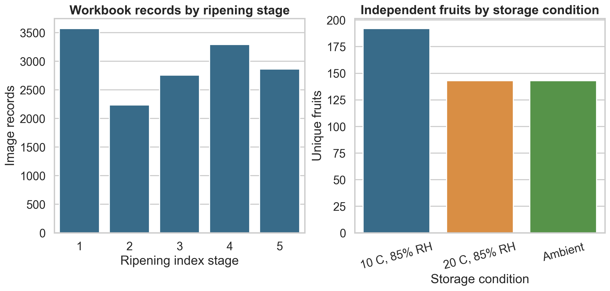
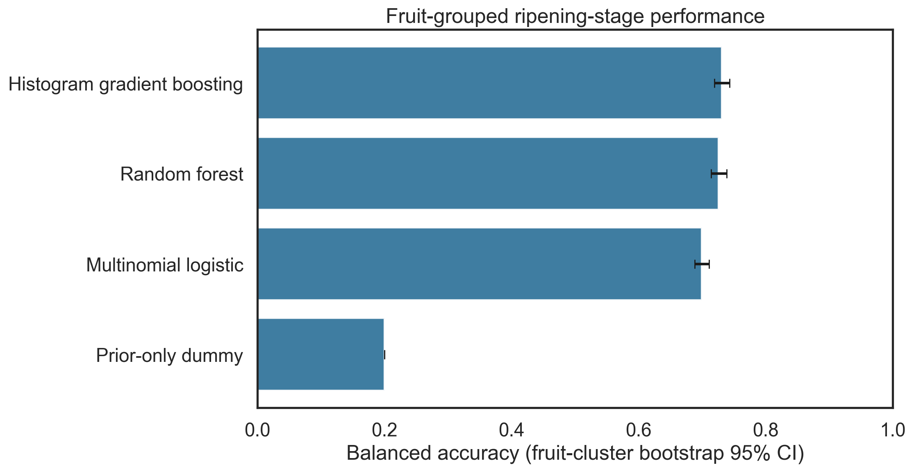
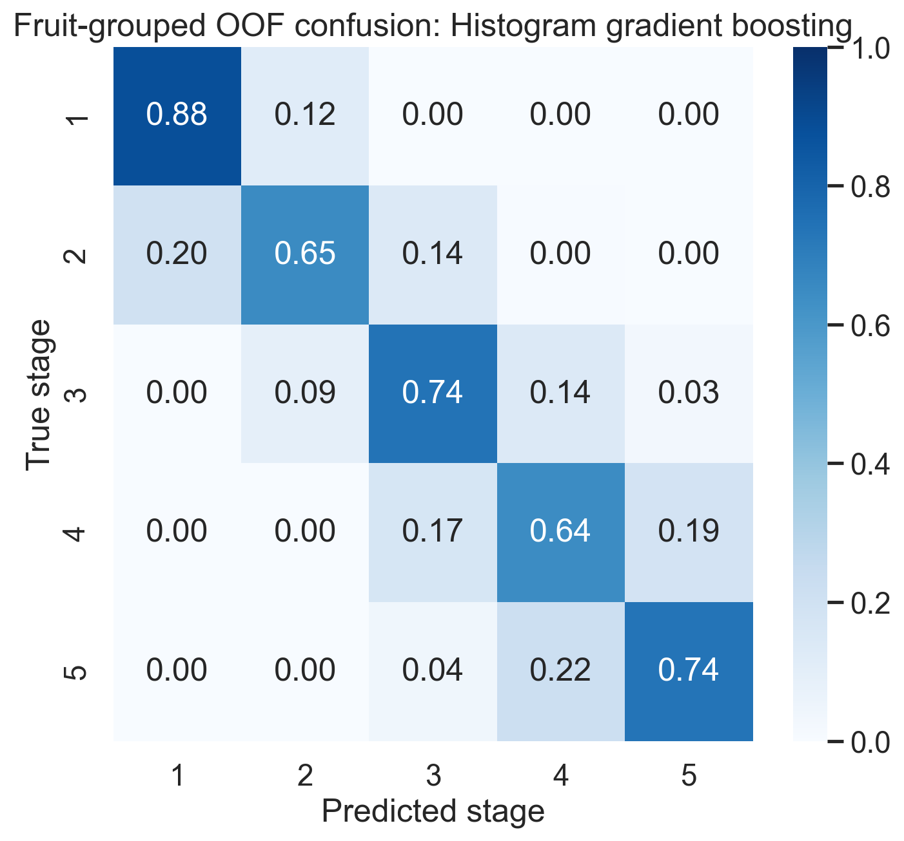
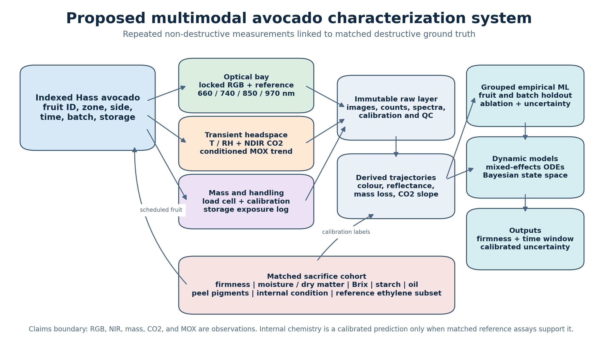

# Development of a Multimodal Non-Destructive Avocado Ripeness Characterization System

## Optical spectroscopy, embedded sensing, machine learning, and scientific machine learning

**Proposal status:** integrated research and prototype design  
**Prepared:** 30 July 2026  
**Primary cultivar:** Hass avocado (*Persea americana* Mill.)  
**Intended discussion:** Collaborators, academic supervisors, and potential
laboratory or funding partners

---

## Evidence and claim convention

This proposal deliberately separates five kinds of statement:

- **DATA-DEMONSTRATED:** directly reproduced from files inspected in this
  workspace.
- **LITERATURE-SUPPORTED:** reported by a cited primary source but not
  independently reproduced here.
- **INFERRED:** a reasoned interpretation of available evidence.
- **PROPOSED:** a method, apparatus, model, or decision rule for future
  validation.
- **NOT IDENTIFIABLE:** current data cannot determine the requested quantity or
  causal effect.

The distinction matters because a large image collection can still contain only
a small number of independent fruits, a sensor feature can be predictive without
being chemically specific, and a mathematical equation can be plausible without
its parameters being identifiable.

## 1. Executive summary

Avocado quality changes rapidly after harvest and is difficult to assess without
cutting the fruit. Consumers and retailers normally combine peel colour,
handling history, and manual squeezing, while research laboratories can measure
firmness, dry matter, moisture, oil, respiration gases, pigments, and spectra.
The inexpensive observations are subjective and incomplete; the more specific
measurements are destructive or require equipment that is not practical at
point of use. An inaccurate readiness estimate contributes to rejected fruit,
premature consumption, missed eating windows, and avoidable waste.

Published work establishes that several non-destructive channels contain useful
information, but it does not yet provide a universally validated avocado
"ripeness meter." RipeTrack reconstructed spectral information from mobile
RGB/NIR observations and reported strong ripeness and remaining-life results,
but its avocado subset contained only 13 independent fruits and used
ethylene-trajectory-derived labels
([Waseem, Sharma, and Hefeeda](https://doi.org/10.1109/TMC.2025.3599917)).
Davur et al. reported low hyperspectral age-prediction error, but their
sub-images from each source image were allocated across training, validation,
and test partitions, so the published result does not demonstrate
generalization to unseen fruit
([Davur et al.](https://doi.org/10.3390/horticulturae9050599)). Clark et al.
showed that NIR interactance can predict avocado dry matter, while later work
has explored moisture, oil, colour, firmness, and deep image models
([Clark et al.](https://doi.org/10.1016/S0925-5214(03)00046-2);
[Olarewaju et al.](https://doi.org/10.1016/j.scienta.2015.12.047);
[Lee, Li, and Ma](https://doi.org/10.1016/j.crfs.2025.101196)).
These studies support feasibility, but their endpoints, spectra, cohorts, split
units, devices, and access conditions differ.

This project proposes a controlled, multimodal, fruit-grouped study that joins:

1. locked and calibrated RGB images;
2. repeatable reflectance or interactance measurements, first at 660, 740, 850,
   and 970 nm and then, where resources permit, over 900-1700 or 900-2500 nm;
3. fruit mass, chamber temperature, relative humidity, and airflow;
4. standardized transient headspace CO2 and broad VOC observations, with
   reference ethylene measurement in a research-grade subset;
5. destructive firmness, moisture/dry matter, soluble solids, starch, oil, peel
   pigments, and internal-condition reference measurements in matched sacrifice
   cohorts.

The computational work completed for this proposal demonstrates the importance
of the validation design. The complete, CC BY 4.0 Hass Avocado Ripening
Photographic Dataset was downloaded and audited
([Xavier, Rodrigues, and Silva](https://doi.org/10.17632/3xd9n945v8.1)).
It contains 14,710 available photographs but only 478 biological fruits.
Five-fold fruit-grouped validation of compact colour features produced 0.731
balanced accuracy for the best five-stage classifier and a 1.853-day mean
absolute error for a retrospective days-to-stage-4 target. When an entire
storage condition was held out, balanced accuracy fell as low as 0.497. These
are **DATA-DEMONSTRATED** internal results, not deployment claims. They show both
that peel colour is useful and that its relationship with stage shifts across
conditions.

The proposal therefore treats ripening as a partially observed dynamic system
rather than as a single image label. Conventional baselines will be compared
with mixed-effects, state-space, survival, chemometric, and temporal machine
learning models. Candidate mass-transfer, pigment, softening, respiration, and
ethylene equations will be fitted only to variables that are measured.
Bayesian state-space modeling and nonlinear mixed-effects ODEs are the preferred
first scientific-machine-learning methods; SINDy, symbolic regression, Neural
ODEs, and physics-informed neural networks are conditional extensions, not
automatic claims of discovered biology.

The minimum viable apparatus has an audited planning total of US$723.62,
including allowances. A research configuration that assumes access to shared
core instruments has a planned purchased-component total of US$6,591.51.
A US$43,466.01 buy-new figure is retained only as a non-quotation planning
proxy for major shared instruments. Exact components, manufacturer part
numbers, sources, limitations, and price status are recorded in
[Appendix D](../appendices/appendix-d-hardware-catalogue.md) and the
[machine-readable bill of materials](../procurement/bill-of-materials.csv).

The intended output is not merely a high classification score. It is an
evidence-auditable dataset and calibrated prototype that can answer which
sensors contribute independent information, how environmental conditions
change transition rates, how uncertainty grows under domain shift, and which
biological quantities remain impossible to infer from a low-cost device.

## 2. Research questions, objectives, and hypotheses

### 2.1 Primary research question

**PROPOSED:** Can calibrated longitudinal RGB, NIR, mass, environmental, and
respiration observations predict instrumental avocado firmness and time to a
predeclared ready-to-eat or end-of-acceptable-quality endpoint for unseen fruits
and unseen harvest batches more accurately and more reliably than RGB-only or
single-sensor baselines?

The question has four deliberate restrictions:

- "calibrated" requires dark/white/colour/gas/mass controls;
- "longitudinal" requires repeated observations of the same identified fruit;
- "unseen" requires fruit- and batch-level holdouts;
- "predeclared endpoint" prevents a threshold from being chosen after seeing
  the test results.

### 2.2 Secondary research questions

1. Which channels add incremental value after controlled RGB colour is known?
2. Does 900-1700 nm or 900-2500 nm spectroscopy materially improve prediction
   of moisture/dry matter and firmness over the four-band MVP?
3. How do temperature, RH, airflow, pre-storage history, harvest batch, and
   initial dry matter modify rates of mass loss, softening, pigment change, and
   CO2 accumulation?
4. Can a coupled state-space or kinetic model improve temporal consistency,
   uncertainty calibration, and transfer across storage regimes relative to a
   black-box predictor?
5. Can low-cost CO2 and MOX channels contribute predictive information without
   being misrepresented as compound-specific ethylene or ethanol measurements?
6. At what measurement frequency does the information gain cease to justify
   the extra handling and apparatus time?
7. How early can the system issue a useful forecast, and how does forecast
   uncertainty change as the endpoint approaches?

### 2.3 Objectives

- Build and metrologically qualify a repeatable scanning/headspace apparatus.
- Publish a fruit-resolved longitudinal data contract with immutable raw files,
  calibration records, and destructive reference links.
- Establish leakage-resistant optical and multimodal baselines.
- Quantify sensor contribution through prespecified ablation.
- Estimate environmental and biological rate parameters with hierarchical
  uncertainty.
- Compare empirical and mechanistic models on the same external batches.
- State clear non-claims where specificity or identifiability is absent.

### 2.4 Hypotheses and null hypotheses

| ID | Alternative hypothesis | Null hypothesis | Primary test |
|---|---|---|---|
| H1 | Multimodal sensing lowers batch-held-out firmness MAE relative to calibrated RGB alone. | The paired error difference is zero or favors RGB alone. | Batch-level paired bootstrap or hierarchical error contrast. |
| H2 | Longitudinal features lower remaining-time error relative to a single current observation. | Trajectory history provides no out-of-batch benefit. | Nested grouped comparison with identical outer folds. |
| H3 | Research-grade NIR predicts moisture/dry matter after fruit- and batch-grouped calibration. | NIR does not outperform a training-set mean or initial-mass baseline. | External RMSEP, bias, R-squared, and RPD with uncertainty. |
| H4 | Calibrated colour adds information about peel pigment/state but is insufficiently invariant across storage regimes. | Colour is either non-predictive or fully invariant. | Ablation plus storage/batch/device holdouts and interaction tests. |
| H5 | Temperature and RH modify ripening and water-loss rate parameters. | Rate parameters do not differ after batch/chamber adjustment. | Hierarchical kinetic model and likelihood/posterior contrasts. |
| H6 | A dynamic state-space model improves forecast calibration or temporal consistency without unacceptable accuracy loss. | It offers no improvement over a matched black-box baseline. | Predeclared composite of error, interval coverage, and monotonicity violations. |
| H7 | CO2 accumulation and conditioned MOX trajectories add information beyond optical and mass channels. | Their conditional permutation/ablation contribution is zero. | Outer-fold ablation with fruit-cluster uncertainty. |
| H8 | A low-cost indicated-ethylene channel is not quantitatively interchangeable with a reference analyzer in mixed avocado headspace. | Agreement is within predeclared analytical limits across stage, T, RH, CO2, and ethanol challenge. | Method-comparison study, bias, LoA, drift, response/recovery. |

No hypothesis treats statistical significance as practical usefulness. Minimum
practically/commercially meaningful differences must be fixed with stakeholders
before confirmatory analysis.

## 3. State of the evidence and research gap

### 3.1 Smartphones, RGB, and colour

Hass peel normally loses green colour and becomes purple-black during ripening,
making controlled colour a useful low-cost channel. The process is not simply
"chlorophyll becomes black pigment." Chlorophyll a and b decline mainly early,
while cyanidin-3-O-glucoside accumulation contributes later darkening
([Cox et al.](https://doi.org/10.1016/j.postharvbio.2003.09.008)).
Temperature can alter anthocyanin accumulation and visible darkening without an
equivalent effect on chlorophyll loss
([Sibeko et al.](https://doi.org/10.17221/72/2023-HORTSCI)).
Colour and internal softening can therefore desynchronize.

Smartphone studies demonstrate useful predictive associations. Cho et al.
reported an artificial-neural-network relationship between smartphone colour
features and avocado maturity, and Lee, Li, and Ma used 1,400 iPhone images
from 140 avocados to predict firmness and classify internal freshness
([Cho et al.](https://doi.org/10.1007/s11694-020-00793-7);
[Lee, Li, and Ma](https://doi.org/10.1016/j.crfs.2025.101196)).
However, random image splits can place views of the same fruit in training and
test data. Cross-batch results in the latter paper are more relevant and show
directional domain shift. Colour is retained here as a required baseline and
ablation channel, not accepted as universal internal ground truth.

### 3.2 NIR and hyperspectral sensing

NIR measurements mix absorption and scattering. Water has strong bands near
1450 and 1930 nm and a weaker feature near 970 nm; C-H combinations and
overtones associated with lipid and other organic material appear in several
regions including approximately 900-920, 1200, 1700, and 2300 nm. A four-band
silicon-detector prototype that stops near 1100 nm cannot separate water,
lipid, scattering, and skin effects with laboratory specificity. The assignments
and their overlap are supported by avocado NIR work spanning silicon and SWIR
ranges
([Clark et al.](https://doi.org/10.1016/S0925-5214(03)00046-2);
[Olarewaju et al.](https://doi.org/10.1016/j.scienta.2015.12.047);
[Mishra et al.](https://doi.org/10.1016/j.infrared.2021.103901)).

Clark et al. reported strong dry-matter prediction using NIR interactance in
Hass avocados, with an independent prediction result of approximately
R-squared 0.88 and RMSEP 1.8 percentage points in that study
([Clark et al.](https://doi.org/10.1016/S0925-5214(03)00046-2)).
Olarewaju et al. evaluated broader NIR for moisture, dry matter, and oil and
found stronger moisture/dry-matter than oil performance
([Olarewaju et al.](https://doi.org/10.1016/j.scienta.2015.12.047)).
Melado-Herreros et al. combined flesh firmness and dry matter in a proposed
ripening index and used 380-2000 nm Vis-NIR spectroscopy; their analysis
identified potential for a lower-cost 400-1100 nm implementation
([Melado-Herreros et al.](https://doi.org/10.1016/j.postharvbio.2021.111683)).
That finding supports investigating a silicon-range device, but a four-discrete-
band MVP contains much less spectral information and must be benchmarked rather
than assumed equivalent.

Mishra et al. directly tested avocado firmness across dehydration conditions
using 350-2500 nm Vis-NIR, acoustic sensing, limited compression, and
penetrometer references. Peel dehydration impaired Vis-NIR transfer, while
Vis-NIR/acoustic fusion reduced firmness-prediction error by 21% in their study
([Mishra et al.](https://doi.org/10.1016/j.infrared.2021.103901)).
This is especially important for the proposed design: water history is both a
biological driver and a source of optical domain shift, and independent
modalities can reduce - but not automatically eliminate - that confounding.

Davur et al. acquired 551 hyperspectral observations from 80 Hass fruits
between 388.9 and 1005.3 nm, but their sub-image partition creates a leakage
risk for unseen-fruit claims
([Davur et al.](https://doi.org/10.3390/horticulturae9050599)).

RipeTrack is important because it joins hyperspectral proof-of-concept,
ethylene-derived staging, RGB-to-spectrum reconstruction, and phone NIR.
Its reported aggregate performance is promising, but its avocado experiments
must be interpreted with the independent-fruit counts and label construction,
not with image count alone
([Waseem, Sharma, and Hefeeda](https://doi.org/10.1109/TMC.2025.3599917)).

### 3.3 Gases, respiration, and storage

Avocado is climacteric: respiration and ethylene participate in the ripening
transition. A sensor that measures chamber CO2 is not measuring ethylene, and a
metal-oxide gas sensor is not measuring a unique VOC. Cross-sensitive
electrochemical ethylene devices require matrix-specific comparison with a
reference analyzer or gas chromatography.

The local Scientific Reports paper concerns apples rather than avocados. Bratu
et al. followed 20 apples from four cultivars over 35 days and observed declining
ethylene and increasing ethanol under their protocol. Its multispectral temporal
patterns were mostly nonuniform or inconclusive; the paper should not be cited
as showing that imaging strongly tracked internal gas change
([Bratu et al.](https://doi.org/10.1038/s41598-021-87530-2)).
Its contribution here is methodological complementarity, not avocado-specific
calibration.

Gwanpua et al. already developed an autocatalytic ethylene model coupled through
Michaelis-Menten-type relationships to avocado softening and colour, with
temperature dependence
([Gwanpua et al.](https://doi.org/10.1016/j.postharvbio.2017.10.002)).
Sierra et al. also modeled postharvest avocado quality kinetics
([Sierra et al.](https://doi.org/10.1177/1082013219826825)).
More recently, van der Sman, Guo, and Pedreschi applied a physics-informed
neural network to postharvest avocado firmness using literature datasets and a
physiological enzymatic-softening/metabolic-rate framework
([van der Sman et al.](https://doi.org/10.1016/j.postharvbio.2025.113898)).
Their results also identify limits that matter here: differences between
controlled-atmosphere and regular-air storage need further model structure, and
orchard, climate, and harvest variation cannot be represented by a single
initial state. Guo et al. subsequently published a broader scientific-machine-
learning framework and model-selection guidance for fruit and vegetable quality
prediction
([Guo et al.](https://doi.org/10.1016/j.postharvbio.2025.114103)).
Hernández et al. provide another relevant dynamic precedent by using
harvest-time metabolites as physiological markers for batch-specific Hass
softening behavior across postharvest logistics
([Hernández et al.](https://doi.org/10.1016/j.postharvbio.2020.111457)).

The proposed project is therefore not the first governing-equation or avocado
PINN model. Its prospective contribution would be a calibrated multimodal
observation system, rigorous fruit/batch/device validation, matched chemistry,
and a like-for-like comparison of statistical, mechanistic, and flexible
dynamic models on newly collected data.

### 3.4 Chemistry and destructive reference measurements

The biologically relevant state is multi-component:

- cell-wall and pectin changes affect mechanical firmness;
- water exchange affects mass, fresh-basis concentration, and texture;
- respiration removes carbon and releases CO2 and water;
- ethylene regulates climacteric responses;
- peel chlorophyll and anthocyanin trajectories affect visible colour;
- starch and soluble carbohydrates may change, while Brix remains a
  concentration rather than a direct starch-conversion balance;
- lipid content is strongly tied to preharvest maturity, and an increase in
  fresh-basis oil percentage after harvest can reflect water loss rather than
  new oil synthesis;
- internal bruising, vascular browning, rot, and chilling injury can break the
  relationship between external appearance and acceptability.

Moisture percentage by oven or validated moisture analysis is destructive:

\[
\mathrm{Moisture}_{wb}(\%) =
100\frac{m_{\mathrm{fresh}}-m_{\mathrm{dry}}}{m_{\mathrm{fresh}}}.
\]

Dry matter on a wet basis is \(100-\mathrm{Moisture}_{wb}\) when the same
sample and method are used. Brix should be modeled jointly with water and,
where starch conversion is claimed, a validated carbohydrate assay. A
mass-balance interpretation is:

\[
\Delta C_{\mathrm{soluble}}
= \text{biochemical production/consumption}
+ \text{concentration or dilution from water change},
\]

not "all Brix increase equals starch converted to sugar."

### 3.5 Gap this project addresses

No inspected public dataset jointly contains longitudinal calibrated RGB/NIR,
mass, continuous environment, firmness, respiration gases, moisture, dry
matter, oil, carbohydrate, pigments, and internal condition. Consequently the
downloaded RGB data cannot identify internal water, oil, pigment concentration,
gas kinetics, starch conversion, or a causal temperature coefficient. The
proposed matched experiment is designed to make a subset of these relationships
estimable while preserving honest limits on compound specificity.

Detailed paper summaries and corrected interpretations appear in
[Appendix A](../appendices/appendix-a-existing-papers.md); the verified
bibliography is in
[Appendix B](../appendices/appendix-b-bibliography.md).

## 4. Public datasets and completed computational audit

### 4.1 Acquisition decisions

| Dataset/source | Access and license finding | Local action | Modeling decision |
|---|---|---|---|
| Hass Avocado Ripening Photographic Dataset v1 | Public, CC BY 4.0 | Complete 418,384,370-byte ZIP downloaded, hashed, extracted, and audited | Primary RGB/longitudinal benchmark |
| Kamat avocado/strawberry archive v1 | Public, CC BY 4.0 | Complete 2,110,769,149-byte ZIP downloaded and hashed; retained unextracted | Excluded until archive structure, originals, augmentation lineage, and fruit IDs are resolved |
| DeepHS Fruit | Public file index; no verified dataset license | Official repository and small annotations retained; 77.3-GB avocado payload not downloaded | License block; no scientific model fitted |
| RipeTrack | Public repository/Drive links; no verified dataset license | Official code repository retained; large fruit payloads not downloaded | License block; no scientific model fitted |
| Davur et al. HSI | Data unavailable due to IP arrangements | Paper audited | Literature only |
| Han et al.; Lee et al. | Reasonable-request access | Not represented as inspected | Literature only unless access and rights are granted |

Public accessibility is not equivalent to permission to reuse or redistribute.
The exact inventory, checksums, source URLs, status, and recommended use are in
[Appendix C](../appendices/appendix-c-public-datasets.md),
[dataset_inventory.csv](../data/dataset_inventory.csv), and
[dataset-audit.md](../docs/dataset-audit.md).

### 4.2 Primary dataset quality

**DATA-DEMONSTRATED:**

| Quantity | Result |
|---|---:|
| Biological fruits | 478 |
| Workbook rows | 14,722 |
| Available JPEG images | 14,710 |
| Workbook rows missing a JPEG | 12 |
| Unlisted JPEGs | 0 |
| Duplicate workbook filenames | 0 |
| Filename/workbook metadata disagreements | 0 |
| Stage records 1/2/3/4/5 | 3,572 / 2,234 / 2,758 / 3,294 / 2,864 |
| Fruits reaching stage 4 during follow-up | 426 |
| Fruits reaching stage 5 during follow-up | 410 |

The median first recorded stage-4 day was 17 days in the 10 C/85% RH group,
7 days in the 20 C/85% RH group, and 7 days in the ambient group. These are
descriptive associations, not a randomized causal temperature estimate.



### 4.3 Reproduced RGB baselines

Foreground-aware colour and compact texture features were extracted without
using the filename, fruit ID, day, side, storage condition, or target in the
predictor matrix. All records of each fruit stayed in one fold.

**DATA-DEMONSTRATED five-fold fruit-grouped results:**

- Five-stage histogram-gradient-boosting classifier: accuracy 0.739
  (fruit-cluster bootstrap 95% CI 0.727-0.751), balanced accuracy 0.731
  (0.719-0.743), macro F1 0.730 (0.719-0.742), ordinal MAE 0.278
  (0.264-0.293).
- Retrospective days-to-first-stage-4 model: MAE 1.853 days
  (1.783-1.922), RMSE 2.636 days (2.542-2.727), R-squared 0.682
  (0.655-0.704).
- Entire-storage-group holdout balanced accuracy: 0.497 for T10, 0.688 for
  T20, and 0.632 for ambient.

The days-to-stage-4 target is derived from the same external composite labels.
It is not an independently observed edible-life endpoint. The weak T10 transfer
is a strong reason to treat storage conditions and colour-domain shifts as
first-class validation problems. Full methods, tables, predictions, split
audit, and limitations are in
[ml-results.md](../reports/ml-results.md).





## 5. Candidate governing relationships

Every equation below is **PROPOSED** unless explicitly attributed to prior
literature. Candidate models are alternatives to compare, not simultaneously
accepted truth.

### 5.1 Temperature-dependent rate constants

An Arrhenius relationship can represent temperature dependence:

\[
k_j(T)=A_j\exp\left(-\frac{E_{a,j}}{R_gT_K}\right),
\]

where \(A_j\) is a pre-exponential factor, \(E_{a,j}\) an apparent activation
energy, \(R_g\) the gas constant, and \(T_K\) absolute temperature. A Q10 form
may be more identifiable over a narrow range:

\[
k_j(T)=k_j(T_{ref})Q_{10,j}^{(T-T_{ref})/10}.
\]

Temperature logs must be sufficiently variable and independently replicated to
estimate either form. A single chamber per condition confounds condition with
chamber.

### 5.2 Water and mass transfer

A compact fruit-level model is:

\[
\frac{dM_w}{dt}=-k_w(T,RH,v)A_f
\left(a_w(M_w,T)-RH_f\right),
\]

where \(M_w\) is water mass, \(A_f\) surface area, \(RH_f\) ambient fractional
RH, \(v\) airflow, and \(a_w\) an effective surface water activity. Observed
total mass also changes through respiration:

\[
\frac{dM}{dt}=\frac{dM_w}{dt}-r_C+r_{\mathrm{deposit}},
\]

so scale loss must not be equated automatically with water loss.

If spatial moisture gradients matter, a radial/surface PDE candidate is:

\[
\frac{\partial W}{\partial t}=\nabla\cdot(D_W(W,T)\nabla W),
\qquad
-D_W\nabla W\cdot n=h_m(W_s-W_{eq}(T,RH)).
\]

This PDE is not identifiable from whole-fruit mass alone. It requires spatial
sampling or strongly informative priors and a known geometry.

### 5.3 Firmness and softening

Simple alternatives include first-order, Weibull, and logistic decay:

\[
\frac{dF}{dt}=-k_F(T)F,\qquad
F(t)=F_\infty+(F_0-F_\infty)\exp[-(k_Ft)^n],
\]

or ethylene-modulated softening:

\[
\frac{dF}{dt}=-k_F(T)
\frac{E^h}{K_E^h+E^h}(F-F_\infty).
\]

The last form reflects the type of coupling already explored in avocado
literature; its parameters require independent ethylene and standardized
firmness measurements. Repeated squeezing is not an acceptable reference
because it changes the fruit and lacks traceable force geometry.

### 5.4 Ethylene and respiration

An autocatalytic ethylene candidate is:

\[
\frac{dE}{dt}=k_{E,0}(T)+k_{E,a}(T)
\frac{E^h}{K_{E}^h+E^h}-k_{E,l}(T)E.
\]

A dynamic headspace observation model is required:

\[
\frac{dC_E}{dt}=
\frac{r_E m_f}{V_h}-k_{\mathrm{leak},E}(C_E-C_{E,amb})
-k_{\mathrm{ads}}C_E,
\]

and similarly for CO2. For a short, well-mixed, leak-corrected accumulation:

\[
r_{CO_2}\approx
\frac{V_h}{m_f}\frac{P}{R_gT_K}
\frac{dx_{CO_2}}{dt}.
\]

Sensor response time, chamber volume, fruit displacement, pressure,
temperature, leakage, adsorption, and range saturation must be accounted for.

### 5.5 Pigments and observed colour

\[
\frac{dC_{chl}}{dt}=-k_{chl}(T)C_{chl},
\]

\[
\frac{dA_{anth}}{dt}
=k_{A}(T)f(R)(A_{\max}-A_{anth})-k_{A,d}A_{anth}.
\]

Observed colour is an observation function:

\[
y_{colour}=g(C_{chl},A_{anth},\mathrm{surface},
\mathrm{illumination},\mathrm{camera})+\epsilon,
\]

not a direct measurement of either pigment. A chemical pigment subset is
needed if pigment concentrations are to be claimed.

### 5.6 Carbohydrate and concentration balance

\[
\frac{dS_{starch}}{dt}=-k_S(T)S_{starch},
\]

\[
\frac{dS_{sol}}{dt}=Y_Sk_SS_{starch}
-r_{\mathrm{resp,sol}}-r_{\mathrm{other}}.
\]

The measured concentration is approximately:

\[
C_{sol}(t)=
\frac{S_{sol}(t)}
{M_w(t)+S_{sol}(t)+M_{\mathrm{other,sol}}(t)}.
\]

Therefore Brix can rise through biochemical conversion, water loss, or both.
Starch and moisture measurements are mandatory for a starch-to-sugar
mass-balance claim.

### 5.7 Lipid and dry matter

Most avocado lipid deposition occurs before harvest. A conservative postharvest
model treats absolute lipid mass as stable or slowly consumed:

\[
\frac{dM_L}{dt}=-r_L(T,R),\qquad
C_{L,fresh}=\frac{M_L}{M}.
\]

Fresh-basis oil percentage can increase as \(M_w\) decreases even without lipid
synthesis. Direct oil extraction or a validated reference method is needed to
calibrate optical estimates.

### 5.8 Latent ripeness and observation system

A parsimonious latent progression variable can use logistic or Gompertz
dynamics:

\[
\frac{dR}{dt}=k_R(T,RH,E)R(1-R),
\]

or

\[
R(t)=\exp[-\exp\{-k(t-t_0)\}].
\]

Measured channels are linked through:

\[
y_{i,t}=h_i(R_t,M_{w,t},C_{chl,t},A_{anth,t},
F_t,E_t,\mathrm{device}_i)+\epsilon_{i,t}.
\]

This construction can regularize forecasts, but a one-dimensional \(R\) may
hide distinct biological pathways and internal disorders. Alternative state
dimensions and posterior predictive checks are required.

### 5.9 Identifiability hierarchy

1. Fit simple descriptive mixed-effects trajectories.
2. Check structural and practical identifiability of each candidate ODE.
3. Add couplings only when corresponding variables are measured.
4. estimate fruit- and batch-level random effects;
5. compare out-of-batch predictive performance and residual structure;
6. reject or simplify models with wide/nonphysical parameters, strong
   posterior correlations, or failed intervention predictions.

Current public RGB data cannot identify the constants above. Equations, variable
definitions, assumptions, and estimation options are collected in
[Appendix E](../appendices/appendix-e-mathematical-models.md).

## 6. Scientific machine learning strategy

### 6.1 Recommended order

**First line:** nonlinear mixed-effects ODEs and Bayesian state-space models.
They naturally express fruit-to-fruit variation, irregular observations,
measurement error, missing destructive states, and uncertainty.

**Second line:** Gaussian-process or spline state estimation followed by SINDy
or constrained symbolic regression. These can propose sparse rate terms but
are sensitive to derivative noise, correlated variables, scaling, and
unmeasured forcing. Every discovered term must be refitted and tested on held-out
batches.

**Third line:** Neural ODEs or universal differential equations that place a
small neural residual beside known mass-balance structure. They are appropriate
only after enough independent trajectories exist.

**Conditional rather than default:** physics-informed neural networks. PINNs
are most compelling when a defensible PDE, boundary conditions, and dense
spatiotemporal observations exist. Sparse whole-fruit time series do not become
mechanistic merely because an ODE residual is added to a loss.

This ordering is informed by the 2026 avocado PINN precedent rather than by an
assumption that PINNs are unexplored. The published model demonstrates the
feasibility of learning common firmness parameters across literature datasets,
while its stated controlled-atmosphere and initial-state limitations reinforce
the need for measured storage conditions and multiple biological states
([van der Sman et al.](https://doi.org/10.1016/j.postharvbio.2025.113898)).
The proposed method-selection gate also follows the principle in Guo et al. that
the balance among knowledge, data volume, prediction goal, efficiency, and
interpretability should determine the SciML method
([Guo et al.](https://doi.org/10.1016/j.postharvbio.2025.114103)).

### 6.2 Candidate methods

| Method | Best use here | Advantage | Principal risk |
|---|---|---|---|
| Bayesian state-space model | Latent ripeness/firmness/moisture with noisy sensors | Full uncertainty and missing-state treatment | Prior sensitivity and computational cost |
| Nonlinear mixed-effects ODE | Population rates plus fruit/batch variation | Interpretable hierarchical kinetics | Structural non-identifiability |
| Extended/unscented Kalman filter | Online state update on embedded/cloud system | Efficient sequential inference | Gaussian/local-linear assumptions |
| Particle filter | Nonlinear/non-Gaussian online state | Flexible uncertainty | Degeneracy and computation |
| Gaussian process | Smooth trajectories and uncertainty | Strong small-data baseline | Scaling and derivative artifacts |
| SINDy | Sparse candidate equation discovery | Interpretable terms | Noise, hidden variables, unstable derivatives |
| Symbolic regression | Alternative functional forms | Human-readable candidates | Search overfit and dimensional inconsistency |
| Neural ODE | Flexible continuous-time latent dynamics | Handles irregular time | Weak mechanistic meaning without constraints |
| Universal differential equation | Known balance plus learned residual | Separates known/unknown components | Learned residual can absorb confounding |
| PINN | PDE/ODE-constrained inverse problem | Joint state/parameter fit | Optimization stiffness and false physical confidence |

### 6.3 Scientific validity tests

- enforce units or nondimensionalize;
- require nonnegative states and physically plausible parameter ranges;
- check structural identifiability before numerical fitting;
- use synthetic recovery tests only as pipeline verification, clearly separated
  from biological evidence;
- compare information criteria, held-out likelihood, forecast error, interval
  coverage, and residual autocorrelation;
- test intervention predictions across temperature/RH conditions not used for
  fitting;
- report posterior predictive checks and parameter correlations;
- compare against a simpler empirical baseline;
- avoid claiming an equation is "discovered" unless it survives independent
  data and targeted perturbation.

## 7. Conventional machine learning workflow

### 7.1 Targets

Primary targets:

1. continuous instrumental firmness in N;
2. time to enter a predeclared ready-to-eat window;
3. time to exit the acceptable window or reach an internal-defect endpoint.

Secondary targets:

- moisture and dry matter percentage;
- oil percentage where reference measurements are available;
- ordinal ripening state;
- internal condition/defect class;
- CO2 production rate;
- calibrated pigment concentrations in a subset.

### 7.2 Feature sets

- RGB: calibrated L*, a*, b*, hue, chroma, colour ratios, texture, segmentation
  masks, and multi-zone variation.
- NIR: dark/white-corrected spectra, absorbance, derivatives, SNV/MSC
  preprocessing candidates, selected bands, PCA/PLS scores, and spatial
  variability.
- Environment: temperature/RH histories, vapour-pressure deficit, cumulative
  thermal exposure, airflow/duty cycle, and storage transitions.
- Mass: absolute and relative change, robust slopes, curvature, and
  temperature-corrected scale diagnostics.
- Gas: leak/range-corrected CO2 accumulation slopes, conditioned MOX
  trajectories, reference ethylene in the validation subset.
- Temporal: time since baseline, change rates, exponentially weighted history,
  and model-derived latent states.

Every derived feature is computed inside the training partition when it
contains fitted parameters. Future time points, endpoint dates, filenames, and
post-outcome information are prohibited predictors.

### 7.3 Models

The progression is:

1. dummy, linear/ridge/logistic, proportional-odds, and PLS/PLS-DA baselines;
2. random forest, gradient boosting, XGBoost or LightGBM, and SVM/SVR;
3. CNN or pretrained visual encoder for sufficiently large image cohorts;
4. temporal convolution, gated recurrent model, or compact transformer only
   when the number of independent trajectories supports it;
5. early-, intermediate-, and late-fusion multimodal architectures;
6. probabilistic or quantile models for prediction intervals.

Complexity must earn its place on an untouched outer batch. Hyperparameters,
feature selection, calibration transfer, and preprocessing are selected inside
nested training folds only.

### 7.4 Validation design

```text
patch/pixel -> source image -> fruit -> batch/harvest -> season/orchard/device
```

All lower-level observations remain inside their parent partition. The minimum
reporting set includes:

- nested fruit-grouped cross-validation for development;
- leave-one-batch-out evaluation;
- a locked final harvest/season/device cohort;
- storage-condition stress tests;
- subgroup performance by initial maturity, mass, temperature, RH, and defect;
- complete split manifests and duplicate/near-duplicate checks.

### 7.5 Metrics and interpretation

Continuous outcomes: MAE, RMSE, R-squared, mean bias, calibration slope,
prediction-interval coverage, and error by forecast horizon.  
Ordinal outcomes: balanced accuracy, macro F1, quadratic-weighted kappa,
ordinal MAE, and per-stage recall.  
Events: time-dependent Brier score, concordance, calibration, and integrated
absolute error under interval censoring.  
Chemometrics: RMSEP, bias, R-squared, RPD, and calibration-transfer error.

Image-level intervals are misleading when one fruit supplies many images.
Uncertainty is bootstrapped or modeled at fruit and batch levels.

### 7.6 Required ablations

- colour only;
- NIR only;
- colour plus NIR;
- optical plus mass/environment;
- optical plus gases;
- all channels;
- current time point only versus longitudinal history;
- discrete LEDs versus full spectrometer;
- empirical model versus empirical plus dynamic state;
- raw device calibration versus transferred calibration.

## 8. Experimental design

### 8.1 Staged design

**Stage A - metrology and feasibility.** Use stable optical targets, check
masses, empty chambers, inert volume controls, gas standards, and approximately
24-30 non-study fruits to quantify repeatability, range, drift, heating,
repositioning error, carry-over, and scan burden. Biological conclusions are
not drawn from this stage.

**Stage B - pilot biological study.** Estimate variance components, missingness,
endpoint frequency, destructive-assay repeatability, and candidate effect sizes.
Use at least two independent receipt/harvest batches. The pilot is used to
simulate confirmatory power, not to optimize and test the same final model.

**Stage C - confirmatory experiment.** A planning design contains 360 fruits:
three temperatures x two RH levels x three independent harvest batches x
20 fruits. Within each condition-by-batch cell, eight fruits form a repeated
non-destructive sentinel cohort and 12 form a sacrifice cohort, with three
fruits assigned to each of four prespecified destructive windows. The final
sample size and number of destructive windows will be set by blinded
variance/power simulation from Stage B.

This design assumes two independently monitored storage chambers or chamber
cycles per temperature-RH condition. If condition has only one chamber, the
temperature/RH effect is confounded with chamber and must be labeled
exploratory. Fruit remains the biological unit; chamber and batch are higher
experimental units.

### 8.2 Fruit inclusion and randomization

Record cultivar verification, supplier/orchard if available, harvest or receipt
date, pre-storage, initial mass, external defects, sun/shade side, and initial
optical state. Exclude only by preregistered criteria. Within each batch,
stratify by initial mass and an initial non-destructive maturity proxy, then
randomize fruit to chamber, position, sentinel/sacrifice role, and destructive
window. Randomize daily measurement order. Assessors of firmness, internal
defects, and chemical assays should be blinded to model predictions and, where
possible, storage condition.

### 8.3 Longitudinal measurement session

1. Verify fruit ID, chamber, scan fixture, sensor clocks, and calibration IDs.
2. Record stable mass after tare with fan and pump off.
3. Capture locked-exposure RGB at indexed sides/azimuths and three axial zones
   with a white/grey or ColorChecker reference.
4. Acquire a dark signal and reference, then sequential optical measurements at
   each wavelength or a full NIR spectrum.
5. Place fruit in the headspace chamber; record ambient/empty baseline.
6. Equilibrate for a fixed interval with controlled mixing and LEDs off.
7. Seal for a fixed, range-safe accumulation interval; log CO2, T, RH, and MOX
   every 1-5 seconds.
8. Vent or flush until a prespecified recovery criterion is met.
9. Return the fruit promptly to its randomized storage position.
10. Write an immutable session manifest and quality flags.

Daily observation is preferred during rapid 20 C/ambient ripening. Cold-stored
fruit may be measured every 24-48 hours after pilot information-loss analysis.
Transfers must be short and standardized because measurement itself changes
temperature and water loss.

### 8.4 Destructive reference session

At the assigned window:

- repeat all non-destructive measurements immediately before sacrifice;
- photograph exterior and standardized cut surfaces;
- measure peel-removed puncture/compression firmness at defined sites, probe,
  speed, depth, and temperature;
- sample matched zones for wet mass and oven-dry or validated moisture analysis;
- calculate dry matter from the same samples;
- measure soluble solids with a calibrated refractometer;
- perform a validated starch/carbohydrate assay if conversion is a claim;
- measure oil by a validated extraction/reference procedure in the designated
  subset;
- quantify peel chlorophyll and anthocyanin in the designated chemical subset;
- record internal browning, bruising, vascular discoloration, rot, and seed
  condition using a blinded rubric;
- retain aliquots according to biosafety, chemical, and storage protocols.

### 8.5 Controls and calibration

| Frequency | Required control |
|---|---|
| Every optical session | Dark, diffuse white, colour target, exposure metadata, saturation flag |
| Every weighing session | Tare, zero stability, before/after check mass |
| Every headspace session | Ambient baseline, close/open timestamps, recovery criterion |
| Daily | Empty chamber or scheduled blank, leak/recovery control, clock sync, cleaning record |
| Weekly/block | CO2 zero/span, multi-point mass calibration, colour-target condition, reference-object repeatability |
| Campaign boundaries | Wavelength/photometric validation, gas calibration, inter-device comparison |

Acceptance criteria must be numerical and locked after metrology, including
repeat-scan coefficient of variation, repositioning error, maximum detector
saturation, scale creep, chamber leakage, gas range compliance, and blank
recovery.

### 8.6 Ground-truth endpoint definition

"Ripe," "ready," and "expired" are operational endpoints, not universal natural
constants. Before confirmatory collection, a panel consisting of the biological
lead, postharvest scientist, statistician, and intended user must define:

- the instrumental firmness window;
- acceptable internal-condition rubric;
- whether flavour/sensory information is required;
- the event used for remaining useful life;
- handling of fruits that never reach an endpoint during follow-up;
- interval-censoring rules;
- thresholds for actionable error.

The endpoint cannot be redefined after viewing locked test performance.

## 9. Prototype and materials to procure



### 9.1 MVP

The minimum system uses:

- Espressif ESP32-S3-DevKitC-1-N8R8 for control/logging;
- Raspberry Pi Zero 2 W (SC1176) and Camera Module 3 standard;
- Calibrite ColorChecker Classic Mini (CCC-MINI);
- Sensirion SHT45 and SCD30;
- Bosch BME688 used only as a conditioned broad MOX gas channel;
- SparkFun TAL220 10-kg load cell and HX711;
- Adafruit ADS1115 and microSD interface;
- Vishay BPW34 silicon photodiode;
- current-regulated 660/740/850/970-nm LED set;
- light-isolated enclosure, indexed cradle, fan, power, analog front end,
  tubing, calibration masses, baffles, and wiring.

The MVP directly measures images, broad optical responses, chamber T/RH, mass,
CO2 concentration, and MOX resistance. It does not directly measure internal
water, oil, starch, ethanol, or reference ethylene.

The silicon-range choice is supported as a cost-reduction research direction by
the 400-1100 nm analysis of Melado-Herreros et al.; it is not a claim that four
LEDs reproduce their 380-2000 nm spectrometer
([Melado-Herreros et al.](https://doi.org/10.1016/j.postharvbio.2021.111683)).
Because Mishra et al. demonstrated degraded Vis-NIR firmness transfer under peel
dehydration, the MVP must log RH and mass and explicitly test
dehydration-condition holdouts
([Mishra et al.](https://doi.org/10.1016/j.infrared.2021.103901)).

### 9.2 Research configuration

The research baseline adds a 900-1700 nm InGaAs spectrometer, stabilized source,
interactance/reflectance probe, certified diffuse reference, inert headspace
vessel and PTFE/PFA flow path, reference ethylene analyzer or validated GC
method, digital refractometer, standardized penetrometer or texture analyzer,
moisture/dry-matter equipment, and chemical assay resources. Extending to
2500 nm is justified only when 1720/2300-nm lipid-sensitive information is an
explicit objective.

### 9.3 Budget and procurement gate

| Tier | Audited planning amount | Interpretation |
|---|---:|---|
| MVP priced core | US$443.67 | Current/listed components with documented price status |
| MVP allowances | US$279.95 | Fabrication, optics, tubing, electronics, calibration allowances |
| MVP total | **US$723.62** | Procurement planning figure, excluding taxes/shipping |
| Research additions assuming shared core instruments | **US$6,591.51** | Purchased components and allowances |
| Buy-new major-instrument proxy | **US$43,466.01** | Non-quotation; includes historical proxy and current listed instruments |
| Optional Hamamatsu C11708MA | EUR650.53 ex VAT | Mid-tier 640-1050-nm option, not a SWIR replacement |

Prices are time-sensitive. Re-quote before ordering. The exact 44-row BOM,
source ledger, limitations, alternatives, and the two locally retained
license-verified product photographs are in
[Appendix D](../appendices/appendix-d-hardware-catalogue.md) and
[procurement/](../procurement/).

## 10. Mechanical design and data architecture

The apparatus has two coupled bays:

1. a light-isolated optical bay with fixed camera/fruit/LED/detector geometry,
   indexed fruit orientation, matte baffles, and removable dark/white
   references;
2. a temporarily sealable, well-mixed headspace bay with controlled
   accumulation, environmental sensing, range checks, and forced recovery.

Optical illumination should be 30-45 degrees from surface normal to reduce
specular reflection, with the camera approximately normal to the peel. Scan the
stem shoulder, equator, and blossom shoulder at multiple indexed azimuths.
Camera exposure, white balance, focus, distance, LED current, integration time,
detector gain, and temperature must be recorded.

The chamber is not long-term storage. Permanent sealing risks hypoxia,
condensation, microbial changes, and history-dependent gas buildup. A
flush-equilibrate-accumulate-vent cycle separates respiration observation from
storage.

The raw data contract uses:

```text
study_id / batch_id / fruit_id / session_id / timestamp_utc /
storage_condition / chamber_id / scan_zone / azimuth / device_id /
firmware_version / calibration_id / raw_value / unit / quality_flag
```

Original images and sensor counts are immutable. Calibrated and derived values
are written to new layers with code and calibration version. Every destructive
sample remains linked to its complete non-destructive history.

Detailed optical, gas-flow, electronics, calibration, and acceptance diagrams
appear in
[prototype-architecture.md](../docs/prototype-architecture.md).

## 11. Variables and measurement rationale

### 11.1 Independent and assigned variables

| Variable | Unit/domain | Role |
|---|---|---|
| Storage temperature | degrees C | Assigned factor; continuous log also retained |
| Relative humidity | % RH | Assigned factor; continuous log also retained |
| Airflow/mixing duty | defined setting | Controlled factor/covariate |
| Harvest/receipt batch | categorical | Independent block/domain |
| Storage time | hours/days | Longitudinal coordinate |
| Chamber/device | identifier | Technical random effect/domain |

### 11.2 Primary dependent variables

| Variable | Method | Status |
|---|---|---|
| Firmness | Standardized destructive force protocol | Direct reference |
| Time into/out of acceptable window | Prespecified composite, interval-censored | Derived primary endpoint |
| Internal defect/acceptability | Blinded cut-surface rubric | Direct ordinal/binary reference |

### 11.3 Non-destructive observations

| Channel | Directly observed | Defensible derived quantity |
|---|---|---|
| RGB | Pixel values under calibration | L*a*b*, hue, chroma, texture, rates |
| NIR | Reference-corrected intensity/spectrum | Calibrated latent/chemical predictions |
| Scale | Force/mass | Net mass trajectory |
| SHT45 | Air T/RH | Exposure history, VPD |
| NDIR CO2 | Chamber CO2 | Corrected accumulation slope |
| MOX | Gas resistance plus T/RH | Conditioned nonspecific VOC feature |
| Low-cost C2H4 bridge | Cross-sensitive indicated current | Exploratory trend after reference comparison |

### 11.4 Destructive/analytical variables

Moisture, dry matter, oil, Brix, starch/carbohydrate, peel pigments, firmness,
internal defect, and reference ethylene require destructive or laboratory-grade
methods for the claims proposed. A low-cost optical estimate remains a model
output whose validity depends on these reference labels.

### 11.5 Confounders and nuisance variables

Cultivar/subclone, orchard, flowering/harvest maturity, pre-cooling, cold
storage duration, supplier handling, sun exposure, fruit size and geometry,
skin damage, bloom, bruising, disease, chamber, device, operator, calibration
lot, scan position, condensate, and fruit-to-fruit biological variation are
recorded or controlled. Unrecorded prehistory is acknowledged rather than
absorbed into a universal ripeness claim.

## 12. Statistical analysis plan

### 12.1 Analysis populations

- metrology population: stable controls and all calibration trials;
- intention-to-observe biological population: every randomized fruit;
- valid-sensor population: records passing prespecified technical QC;
- destructive-reference population: all assigned sacrifices, including failed
  assays with reason codes;
- locked external population: untouched batch/season/device cohort.

Exclusions are reported by fruit and reason. Failed measurements are not
silently deleted.

### 12.2 Descriptive and experimental analyses

For repeated continuous outcomes:

\[
y_{ijkt}=\beta_0+\beta_TT_i+\beta_HH_j+\beta_{TH}T_iH_j+
f(t)+\text{interactions}
+b_{\mathrm{batch}}+b_{\mathrm{chamber}}+b_{\mathrm{fruit}}
+\epsilon.
\]

Use flexible time effects or candidate kinetics, fruit random intercepts/slopes,
batch and chamber effects, and heteroscedastic/autocorrelated residuals where
supported. Destructive outcomes are analyzed with condition, time, batch, and
chamber hierarchy but no repeated fruit effect.

Time-to-ready/end-of-quality is analyzed as interval-censored survival, with
frailty/random effects for batch and chamber. Competing internal-defect events
are modeled or reported separately.

### 12.3 Sample size

The 360-fruit confirmatory layout is a planning design, not a claim of achieved
power. Final n will be selected by simulation using pilot estimates for:

- batch and chamber intraclass correlation;
- fruit-level residual variance and serial correlation;
- endpoint censoring and missingness;
- smallest useful difference in firmness MAE and remaining-time MAE;
- number of outer batches available;
- multiplicity across primary endpoints.

The effective sample size is driven by independent fruits, batches, and
chambers - never by images, pixels, or spectra.

### 12.4 Missingness and censoring

Record reason codes for sensor failure, saturation, absent image, assay failure,
fruit damage, contamination, and endpoint not observed. Mixed/state-space
models can use incomplete trajectories under explicit assumptions. Sensitivity
analyses include complete-case, multiple-imputation or model-based missingness,
and worst-reasonable scenarios for informative fruit loss. Fruits not reaching
the endpoint are censored, not assigned an arbitrary remaining time.

### 12.5 Multiplicity and uncertainty

Define a small primary family before collection. Use hierarchical testing or
false-discovery-rate control for secondary sensor/biomarker screens. Report
effect sizes and 95% intervals, not only p-values. Bootstrap at fruit and batch
levels, propagate calibration uncertainty, and present prediction intervals
with observed coverage.

### 12.6 Model comparison

All competing models use identical outer folds and target definitions. Compare
paired fruit/batch errors, calibration, coverage, subgroup behavior, and
computation. Statistical superiority without a meaningful improvement or
transfer robustness is insufficient for adoption.

## 13. Project timeline and phase execution

### 13.1 Work already executed in this workspace

| Phase | Completed output |
|---|---|
| 1 | Public-source discovery, licensing decisions, dataset inventory |
| 2 | Archive inspection, schema reconciliation, data dictionary, QA |
| 3 | Fruit-level EDA and publication-ready figures |
| 4 | Fruit-grouped classification/regression baselines and storage holdout |
| 5 | Candidate governing relationships and identifiability plan |
| 6 | Primary/secondary questions, hypotheses, nulls |
| 7 | Matched longitudinal/sacrifice experimental design |
| 8 | Measurement matrix and rationale |
| 9 | MVP and research-grade prototype architecture |
| 10 | 44-row sourced procurement catalogue |
| 11 | Statistical analysis and validation plan |
| 12 | Integrated proposal |
| 13 | Draft communication to prospective collaborators |
| 14 | Appendices, source/QA ledgers, scripts, figures, and rendered PDF |

### 13.2 Future experimental timeline

| Month | Activity | Gate |
|---:|---|---|
| 1-2 | Supervisor/stakeholder endpoint definition, protocol review, data-management plan | Signed endpoint and claims matrix |
| 2-3 | Re-quote/procure MVP, fabricate chamber and fixture | BOM and safety review |
| 3-4 | Firmware, logging schema, camera and optical integration | Schema validation |
| 4-5 | Metrology: optical repeatability, mass drift, chamber leaks, gas range, carry-over | Numerical acceptance criteria pass |
| 5-6 | Pilot fruit cohort and destructive-method training | Pilot QA report |
| 6-7 | Blinded variance/power simulation; preregistration; model freeze plan | Confirmatory protocol approval |
| 7-10 | Multi-batch confirmatory collection | Batch-complete QA, no outcome-driven retraining |
| 8-11 | Reference assays, data lock, conventional ML and statistics | Locked external set untouched |
| 10-12 | Dynamic/scientific-ML comparison and identifiability analysis | Posterior/holdout diagnostics |
| 12-13 | External-device or additional-season validation | Deployment boundary decision |
| 13-15 | Manuscript, dataset/code release subject to rights, prototype revision | Reproducibility audit |

## 14. Risk analysis and mitigation

| Risk | Consequence | Mitigation / decision rule |
|---|---|---|
| Same fruit appears across splits | Inflated performance | Immutable fruit IDs and automated zero-overlap split audit |
| One chamber per condition | Chamber-condition confounding | Independent chamber replication or label effects exploratory |
| Colour/internal state desynchronization | Unsafe ripe/ready inference | Multimodal sensing and internal/firmness reference |
| NIR scattering/water/lipid confounding | False chemical specificity | Broad-spectrum reference calibration, geometry controls, non-claims |
| MOX/electrochemical cross-sensitivity | Mislabelled ethylene/VOC result | Reference comparison, challenge gases, broad-feature labeling |
| CO2 range saturation or leaks | Biased respiration slope | Shorter accumulation, larger chamber, leak/blank correction, flags |
| Optical heating and condensation | Alters fruit/sensor signal | Separate phases, thermal logs, controlled duty, recovery |
| Scale drift or contact forces | False mass-loss trend | Isolated cradle, calibration/creep checks, fan off |
| Destructive assay variability | Weak labels | Frozen protocol, operator training, duplicates, blinded QC |
| Dataset shift across batch/season/device | Deployment failure | Locked external cohorts and calibration-transfer study |
| Endpoint defined after results | Optimistic bias | Stakeholder-signed preregistration |
| Too few independent batches | Unstable generalization estimate | Prioritize batches over extra views; hierarchical uncertainty |
| Attrition/non-ripening fruit | Biased remaining-time model | Interval censoring and missingness sensitivity |
| Overparameterized ODE | Non-identifiable rates | Structural checks, staged complexity, priors, intervention validation |
| Public-data rights ambiguity | Legal/reproducibility risk | Acquire only verified licenses; request written permission |
| Price/availability change | Prototype delay | Re-quote, approved alternatives, staged purchasing |
| 3D-print/enclosure outgassing | Headspace artifacts | Blank/recovery study; inert materials for analytical configuration |
| Chemical/solvent work | Safety risk | Institutional SOPs, training, fume hood, waste process |

Stop/go decisions are evidence based. For example, if discrete 970-nm
repeatability is poor or adds no outer-fold information, it remains a teaching
channel rather than being marketed as moisture sensing. If a low-cost ethylene
bridge fails analytical agreement, it may remain a nonspecific feature but
cannot retain an ethylene-concentration label.

## 15. Expected contributions, limitations, and future work

### 15.1 Expected contributions

1. A public-data audit that distinguishes images from biological sample size
   and documents access/licensing boundaries.
2. Reproducible fruit-grouped RGB baselines and a quantified
   storage-distribution shift.
3. A procurement-ready, claims-aware multimodal prototype.
4. A matched longitudinal/destructive protocol capable of calibrating optical
   and gas features to real reference quantities.
5. A common validation framework for black-box, statistical, kinetic, and
   scientific-ML models.
6. An explicit identifiability and non-claims framework.

### 15.2 Limitations that remain even after the proposed study

- One cultivar and limited sources do not establish general avocado validity.
- Ready-to-eat quality is partly sensory and use-case dependent.
- Destructive matched cohorts approximate, rather than reveal, the unobserved
  internal state of a surviving sentinel fruit.
- A chamber measurement is not the same as a supermarket or home environment.
- Spectrometer calibration can be device- and geometry-specific.
- Mechanistic models are simplified representations of coupled biology.
- A statistically accurate forecast may still be operationally unhelpful if
  its uncertainty is too wide or its workflow too burdensome.

### 15.3 Future work after successful external validation

- edge inference with model cards and abstention under domain shift;
- smartphone or kiosk integration with a calibration accessory;
- industrial sorting and robotic handling;
- harvesting decisions based on orchard maturity rather than only postharvest
  ripeness;
- other cultivars and fruit species with separate calibration;
- cloud longitudinal database with consent, governance, and drift monitoring;
- transfer learning and calibration transfer between devices;
- federated learning only where multiple institutions have comparable
  protocols and governance;
- digital-twin forecasting constrained by measured mass, respiration, and
  temperature histories;
- intervention optimization for storage temperature, RH, and venting;
- consumer studies testing whether predictions actually reduce waste.

Commercial deployment, phone-only claims, and automated decisions are future
possibilities, not deliverables of the initial experiment.

## 16. Deliverables and decision request

The complete package contains:

- source PDFs and evidence-corrected paper summaries;
- licensed public datasets and immutable checksums;
- dataset inventory, QA report, processed tables, and data dictionary;
- EDA scripts, figures, and machine-readable outputs;
- grouped ML training, out-of-fold predictions, split audit, metrics, and model;
- candidate mathematical models and scientific-ML plan;
- experimental protocol, measurement rationale, and statistical plan;
- prototype diagrams, 44-row procurement BOM, source ledger, exact MPNs, and
  licensed component photographs;
- a message draft for prospective collaborators;
- reproducibility scripts, repository structure, appendices, and rendered PDF.

The immediate decision requested from collaborators is whether to proceed to a
metrology-first MVP build and a two-batch pilot, and which laboratory resources
are available for NIR, reference ethylene, firmness, moisture/dry matter, oil,
pigment, and carbohydrate assays. Those answers determine whether the first
study can support internal-chemistry claims or should remain a rigorously
bounded optical/environmental feasibility study.

---

## Appendix map

- [Appendix A - Existing papers](../appendices/appendix-a-existing-papers.md)
- [Appendix B - Verified bibliography](../appendices/appendix-b-bibliography.md)
- [Appendix C - Public datasets](../appendices/appendix-c-public-datasets.md)
- [Appendix D - Hardware catalogue](../appendices/appendix-d-hardware-catalogue.md)
- [Appendix E - Candidate mathematical models](../appendices/appendix-e-mathematical-models.md)
- [Appendix F - Software stack](../appendices/appendix-f-software-stack.md)
- [Appendix G - Repository structure](../appendices/appendix-g-repository-structure.md)
- [Appendix H - Data quality and data dictionary](../appendices/appendix-h-data-quality.md)
- [Appendix I - Machine-learning results](../appendices/appendix-i-ml-results.md)
- [Appendix J - Statistical analysis plan](../appendices/appendix-j-statistical-plan.md)
- [Appendix K - Reproducibility manifest](../appendices/appendix-k-reproducibility.md)
- [Appendix L - Risks, claims, and evidence matrix](../appendices/appendix-l-risk-evidence.md)
