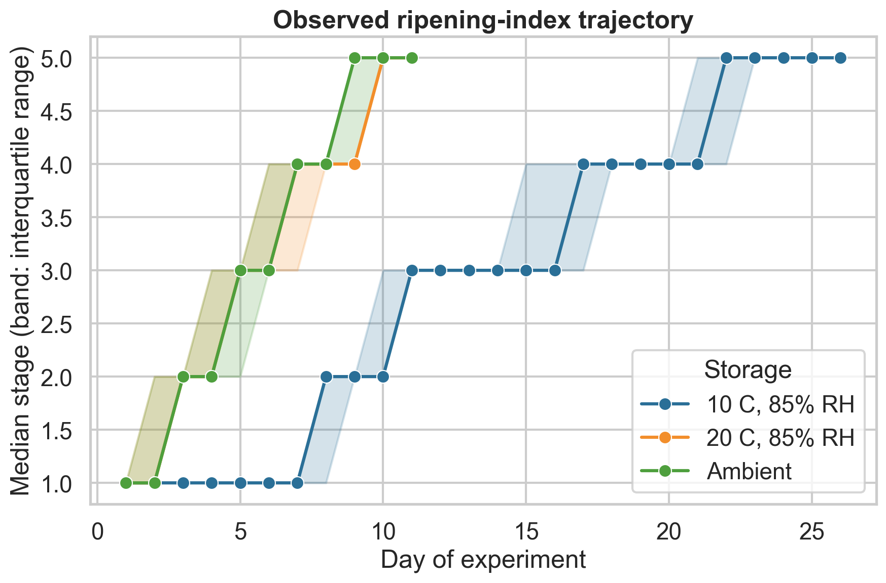
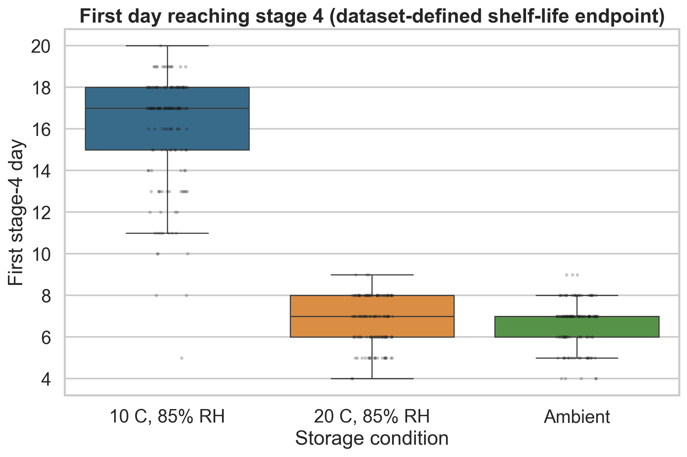
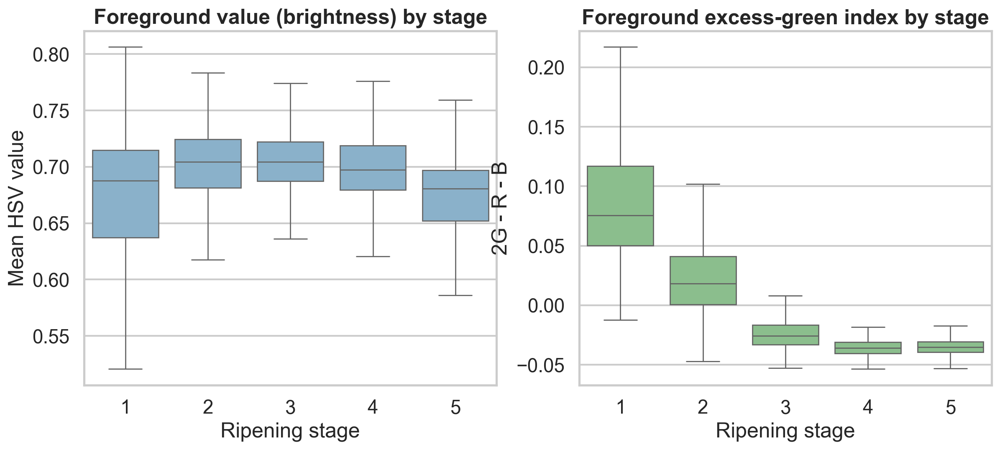

# Exploratory Analysis

**Dataset:** Xavier et al. 2024, DOI
[10.17632/3xd9n945v8.1](https://doi.org/10.17632/3xd9n945v8.1)  
**Independent unit:** biological fruit (`n = 478`)  
**Available images:** 14,710  
**Evidence class:** **DATA-DEMONSTRATED**

## Main findings

1. Storage groups have very different follow-up lengths. The median first
   stage-4 day is 17 for the 10 C group and 7 for both the 20 C and ambient
   groups.
2. The 10 C group contributes 8,866 available images, compared with 2,920 and
   2,924 in the 20 C and ambient groups. Image-weighted estimates therefore
   overrepresent cold-stored trajectories.
3. Peel brightness and excess-green distributions shift across the five source
   stages, supporting RGB as a predictive surface channel. Their distributions
   overlap substantially, so color is not a deterministic internal-ripeness
   measurement.
4. Fifty-two fruits do not reach stage 4 during recorded follow-up and 68 do
   not reach stage 5. Remaining-time analysis must handle follow-up boundaries
   explicitly.

## Cohort structure

| Storage | Fruits | Workbook records | JPEGs | Median first stage-4 day | IQR |
|---|---:|---:|---:|---:|---:|
| 10 C, 85% RH | 192 | 8,870 | 8,866 | 17 | 3 |
| 20 C, 85% RH | 143 | 2,926 | 2,920 | 7 | 2 |
| Ambient | 143 | 2,926 | 2,924 | 7 | 1 |

The three trajectories should not be interpreted as a randomized causal
temperature experiment. The public workbook does not supply enough batch,
orchard, fruit-selection, continuous ambient RH/temperature, or handling
history to identify a temperature coefficient without assumptions.

## Longitudinal stage trajectories

The figure first reduces the two sides to one fruit-day value, then plots the
median and interquartile interval across fruits. Cold storage shifts the stage
trajectory later, as expected from the study design, but this is a descriptive
association in this dataset.

## Dataset-defined shelf-life endpoint

Stage 4 is the source study's operational end-of-shelf-life point. The derived
target `days_to_stage4_signed` is useful for a computational demonstration, but
it is not an independent chemical or instrumental endpoint: it is calculated
from the same ordinal ripening labels used for classification.

## Color trends

Foreground mean HSV value generally falls as Hass peel darkens. Excess green
also changes with stage. The overlap illustrates why color should complement
NIR, firmness, mass, environment, and respiration rather than replace them.
Published pigment work supports this interpretation:
[Cox et al.](https://doi.org/10.1016/j.postharvbio.2003.09.008) reported early
chlorophyll decline followed by anthocyanin accumulation, and
[Sibeko et al.](https://doi.org/10.17221/72/2023-HORTSCI) showed that ripening
temperature affects darkening and anthocyanin in a way that can desynchronize
color from internal softening.

## What the EDA cannot show

- **NOT IDENTIFIABLE:** internal water, dry matter, oil, starch, sugar mass,
  chlorophyll concentration, anthocyanin concentration, ethylene, CO2, or
  fermentation products.
- **NOT IDENTIFIABLE:** a causal water-loss rate, because fruit mass, continuous
  RH/temperature, and airflow are absent.
- **NOT IDENTIFIABLE:** device/orchard/season generalization, because the
  downloaded cohort is one source study.
- **NOT IDENTIFIABLE:** consumer edible quality or internal rot from the
  five-stage external composite label alone.

## Reproduction

`analysis/run_eda.py` regenerates the four figures,
`analysis/eda-summary.json`, and `tables/eda-summary.csv`.
